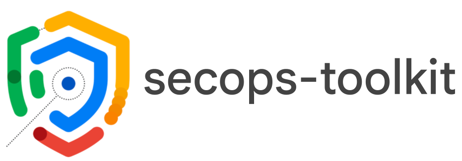

  <picture>
    <source media="(prefers-color-scheme: dark)" srcset="./assets/logo.png">
    
  </picture>

# Terraform Blueprints, Modules and sample CICD-ready repositories for SecOps

This repository provides **end-to-end blueprints**, a **suite of Terraform modules** and sample CICD repository for Google SecOps, which support different use cases.

The whole repository is meant to be cloned as a single unit, and then forked into separate owned repositories to seed production usage, or used as-is and periodically updated as a complete toolkit for prototyping. You can read more on this approach in our [contributing guide](./CONTRIBUTING.md).
