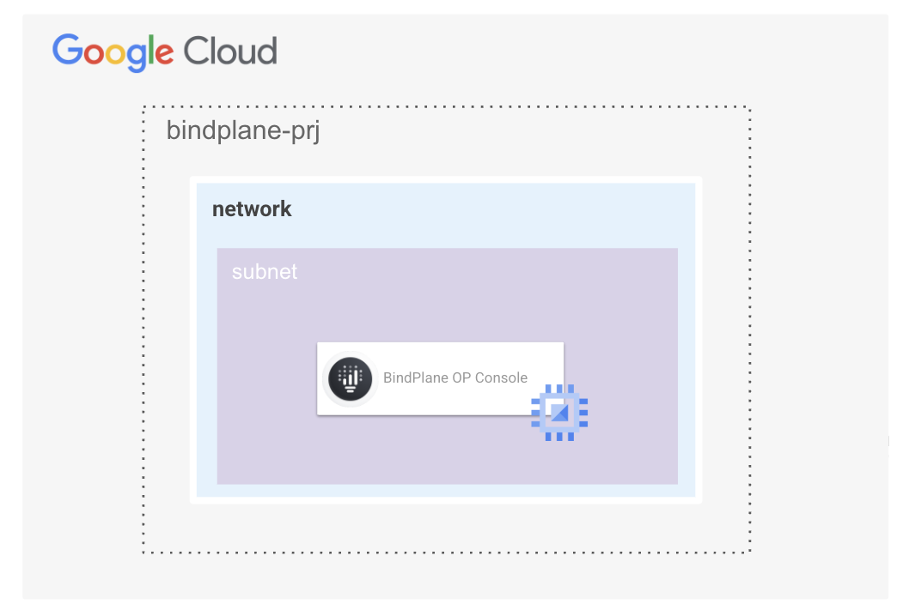
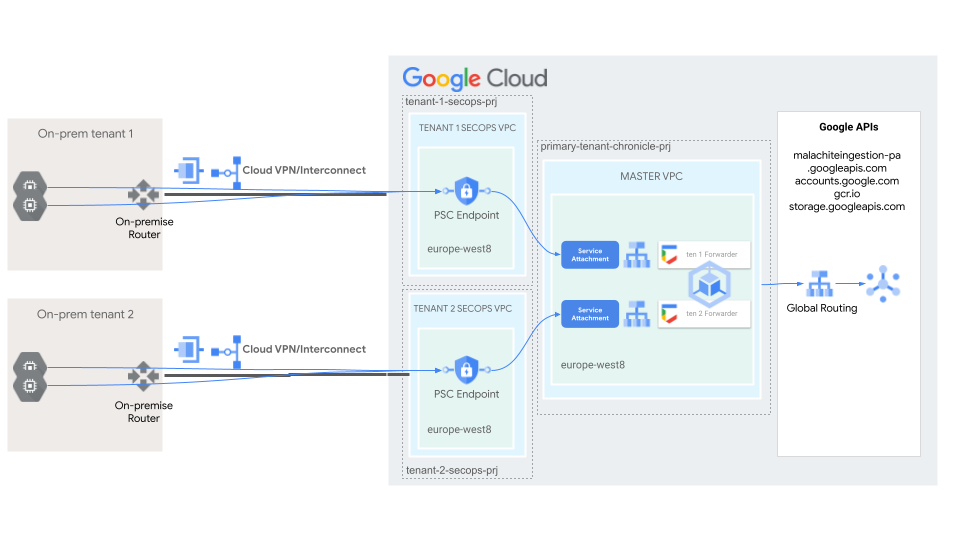
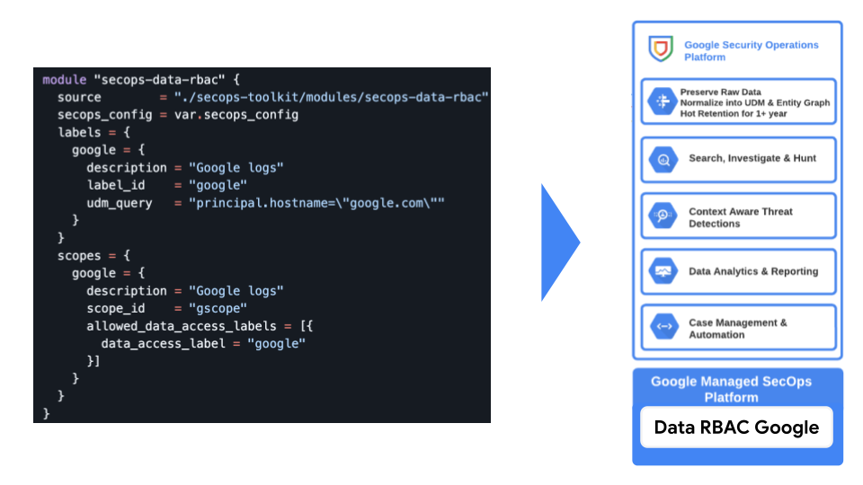

  <picture>
    <source media="(prefers-color-scheme: dark)" srcset="./assets/logo-dark.png">
    <source media="(prefers-color-scheme: light)" srcset="./assets/logo-light.png">
    
  </picture>

# SecOps Toolkit

This repository provides a comprehensive collection of Terraform blueprints, modules, and CICD pipelines designed to automate the implementation of custom integrations, agents, and configurations for Google Cloud SecOps (formerly Chronicle). It aims to provide modular and scalable solutions for various SecOps automation needs.

# Blueprints

This section details the available Terraform blueprints for deploying and managing Google Cloud SecOps components and integrations.

### BindPlane OP Management container running on cos-based GCE instance

 
This [blueprint](./blueprints/bindplane-gce/) is a simple script for running BindPlane OP Management Console container on Google Compute Engine instance with COS.

 

### BindPlane OP Management on GKE

 
This [blueprint](./blueprints/bindplane-gke/) is a modular and scalable solution for deployment of the BindPlane OP Management Console within a Google Kubernetes Engine (GKE) environment.

 

### SecOps Anonymization Pipeline

 
This [blueprint](./blueprints/secops-anonymization-pipeline/) is a comprehensive and adaptable solution for constructing a SecOps pipeline for exporting raw data from a SecOps tenant, optionally anonymize this data and then import data back in a different SecOps tenant.

 

### SecOps GKE Forwarder

 
This [blueprint](./blueprints/secops-gke-forwarder/) is a modular and scalable solution for setting up a SecOps forwarder on Google Kubernetes Engine (GKE). This forwarder is designed to handle multi-tenant data ingestion, ensuring secure and efficient log forwarding to your SecOps SIEM instances.

 

## SecOps Instance

 
This [blueprint](./blueprints/secops-instance/) allows automated configuration of SecOps instance at both infrastructure and application level.

 

### SecOps Tenant

 
This [blueprint](./blueprints/secops-tenant/) allows automated configuration of a SecOps instance at both infrastructure and application level with out-of-the-box Feeds integration, automated deployment of SecOps rules and reference lists, as well as Data RBAC scopes.

 

## SecOps Tenant Factory

 
This [blueprint](./blueprints/secops-tenant-factory/) implements end-to-end configuration of new projects and SecOps SIEM tenants via YAML data configurations and [secops-tenant](./blueprints/secops-tenant) blueprint code. 

 

# Modules

This folder contains a suite of Terraform modules for Google SecOps automation. These modules are designed to be composed together and can be forked and modified where the use of third-party code and sources is not allowed.

Modules aim to stay close to the low-level provider resources they encapsulate and share a similar interface that combines management of one resource or set of resources, and their corresponding IAM bindings.

### SecOps Data RBAC

 
 
This [module](./modules/secops-data-rbac) allows configuration of Data RBAC in Google SecOps.

 

### SecOps Rules and Reference lists

 
This [module](./modules/secops-rules) allows creation and management of custom rules as well as reference lists in Google SecOps.

 

# Pipelines

This repository provides a collection of sample repositories for automating Google Cloud SecOps configuration through CICD pipelines.

### Detection As Code

 
This [sample repository](./pipelines/detection-as-code/) contains ready-to-use code for automated deployment of detection rules and reference lists in Google SecOps via CICD (currently with sample pipelines for GitLab and GitHub).

 

## Parsers As Code

 
This [sample repository](./pipelines/parsers-as-code/) provides a framework for managing SecOps parsers as code.

 

## Response As Code

 
This [sample repository](./pipelines/response-as-code/) provides a framework to manage and deploy SOAR playbooks using a "Response as Code" methodology.

 
