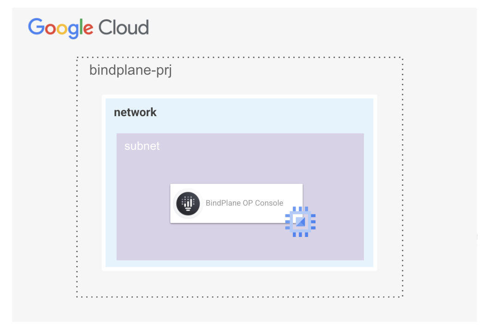
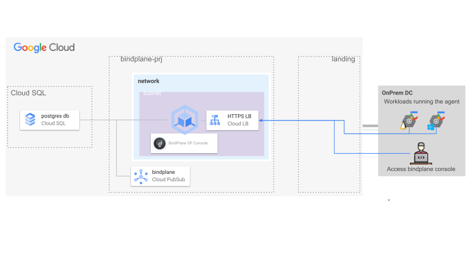
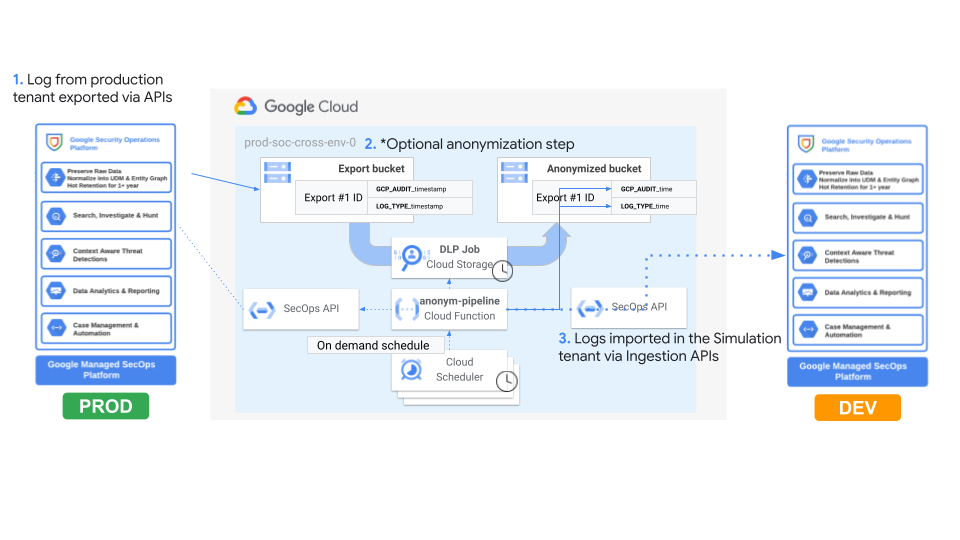
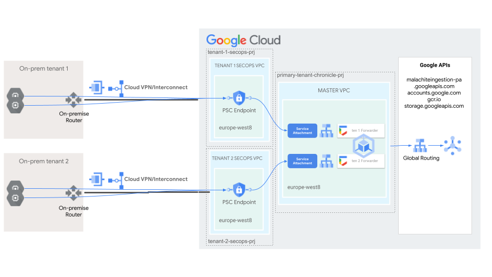
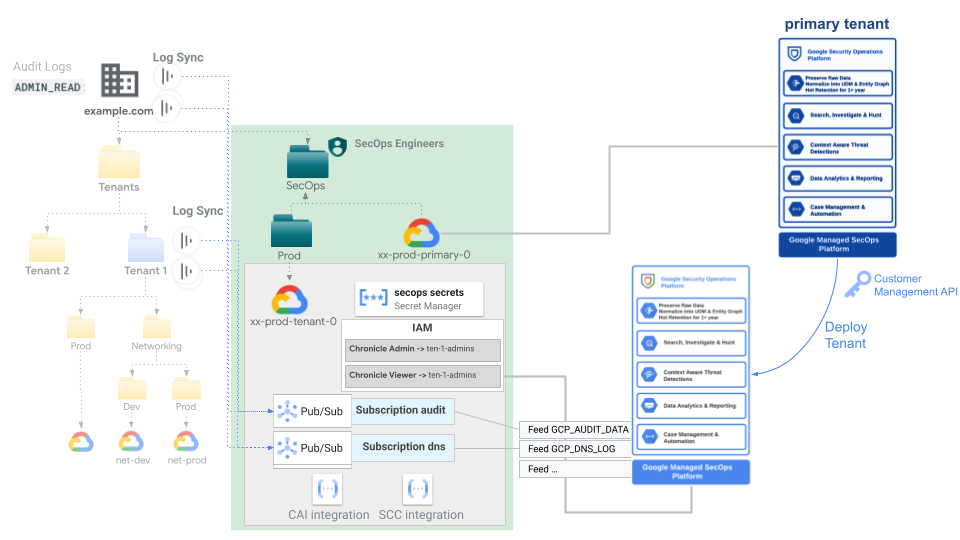
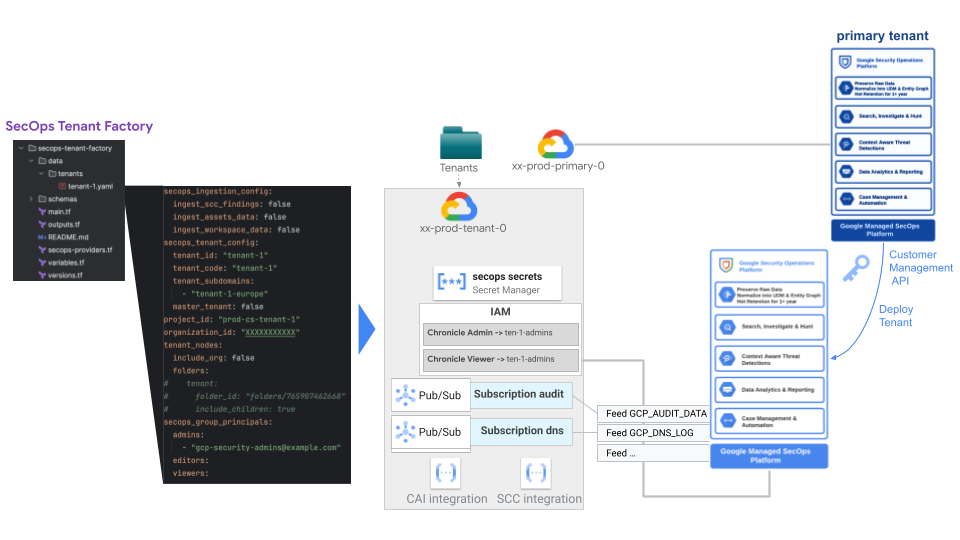

# SecOps blueprints

This repository provides a collection of Terraform blueprints designed to automate the implementation of custom integrations, agents and configurations for Google Cloud SecOps (aka Chronicle).

## BindPlane OP Management container running on cos-based GCE instance

 
This [blueprint](./bindplane-gke/) is a simple script for running BindPlane OP Management Console container on Google Compute Engine instance with COS.

 

## BindPlane OP Management on GKE

 
This [blueprint](./bindplane-gke/) is a modular and scalable solution for deployment of the BindPlane OP Management Console within a Google Kubernetes Engine (GKE) environment.

 

## SecOps Anonymization Pipeline

 
This [blueprint](./secops-gke-forwarder/) is a comprehensive and adaptable solution for constructing a SecOps pipeline for exporting raw data from a SecOps tenant, optionally anonymize this data and then import data back in a different SecOps tenant.

 

## SecOps GKE Forwarder

 
This [blueprint](./secops-gke-forwarder/) is a modular and scalable solution for setting up a SecOps forwarder on Google Kubernetes Engine (GKE). This forwarder is designed to handle multi-tenant data ingestion, ensuring secure and efficient log forwarding to your SecOps SIEM instances.

 

## SecOps Tenant

 
This [blueprint](./secops-tenant/) allows automated configuration of SecOps instance at both infrastructure and application level with out of the box Feeds integration, automated deployment of SecOps rules and reference lists as well as Data RBAC scopes.

 

## SecOps Tenant Factory

 
This [blueprint](./secops-tenant-factory/) implements end-to-end configuration of new projects and SecOps SIEM tenants via YAML data configurations and [secops-tenant](./secops-tenant) blueprint code. 

 
