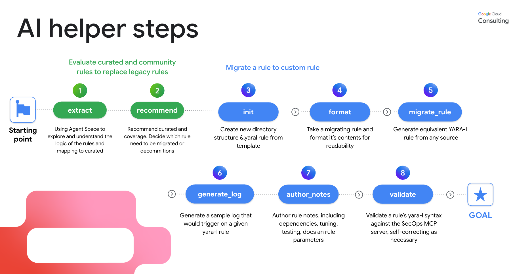

# SecOps AI Migration Helper 

**PROTOTYPE**

Migration helper is a tool that helps you migrate rules from a SIEM to Google SecOps and reduce the migration time significantly. It uses GenAI to help you migrate the rules in multiple steps. 

- The AI helper operates in clearly defined small steps, each with specific inputs and outputs. 
- A SecOps Consultant (Human in the loop) validates the output after every step. For example: formatting an original rule, then manual visual validation, then adding comments, etc.
- A general all-in-one approach (migrating everything without considering equivalence to curated rules) is counterproductive. 
- The more rules are migrated, the knowledge base of the GenAI tool increases and migration becomes more accurate. 
- The tool is flexible by understanding different formats of rules from a SIEM. It is not limited to the original language of the rule. 

Migration Steps overview 

---

## Features

* **AI Migration helper** leveraging GenAI, SecOps MCP and Gemini CLI to automate the migration.
* **Recommender Tool**: A GenAI-powered script that maps existing rules (KQL, SPL, ArcSight, etc.) to equivalent Google SecOps Curated or Community rules.
---

## Installation

### Gemini CLI 

Follow [Gemini CLI](https://github.com/google-gemini/gemini-cli)

### Setup SecOps MCP integration and Gemini CLI  

#### MCP SecOps setup 

Follow [MCP Security](https://github.com/google/mcp-security)

Add settings file `.gemini/settings.json` for MCP server integration you c an find more detail on [Using Google SecOps with Gemini CLI and Hosted MCP] https://medium.com/@thatsiemguy/using-google-secops-with-gemini-cli-and-hosted-mcp-6400ec8aa99e

---
## Usage

Start the Gemini CLI and execute a command with `/<command>` arguments. Following are described the commands and their arguments:

### Tune the Gemini CLI commands to your use case 
Every migration is different and it is very important to adapt the Gemini CLI commands in `.gemini` to your particular use case. Take one sample rule, execute it multiple times and adjust the commands accordingly until you get the desired output. After this, start the mass migration of the rules.

### Evaluate curated and community rules to replace legacy rules: 

Note: You can execute the recommendation also as a standalone Python script and set up parameters via environment variables. See [recommender_curated_community/README.md](./recommender_curated_community/README.md)

- `extract <file_path>`: Using Agent Space to explore and understand the logic of the rules and map them to curated rules.
- `recommend <file_path>`: Recommend curated rules and coverage. Decide which rules need to be migrated or decommissioned. Evaluate curated and community rules to replace legacy rules. 

### Migrate a rule to a custom rule: 

- `init <new_rule_name>`: Create new directory structure & `.yaral` rule from template 
- `format <migrating_rule_path> <new_rule_name>`: Take a migrating rule and format its contents for readability 
- `migrate_rule <new_rule_path>`: Generate equivalent YARA-L rule from any source 
- `generate_log <new_rule_path>`: Generate a sample log that would trigger on a given YARA-L rule 
- `author_notes <new_rule_path>`: Author rule notes, including dependencies, tuning, testing, docs and rule parameters 
- `validate <new_rule_path>`: Validate a rule’s YARA-L syntax against the SecOps MCP server, self-correcting as necessary 

### Directory Structure

Main files and directories:
- `recommender_curated_community/`: The Python recommender tool for discovering relevant curated or community rules, powered by Vertex AI models.
- `migration_rules/`: Examples and demonstration files of rules from distinct SIEM platforms (e.g., KQL, ArcSight, SPL). Place here the rule you want to migrate.
- `rules/`: Repository for the resulting YARA-L detection rules, with dedicated subdirectories for each rule including optional `sample_logs`. It contatin some sample.

### Contributing
Contributions are welcome! Please feel free to submit a pull request with any improvements or bug fixes.

1. Fork the repository.
2. Create a new branch (`git checkout -b feature/your-feature`).
3. Commit your changes (`git commit -am 'Add some feature'`).
4. Push to the branch (`git push origin feature/your-feature`).
5. Create a new Pull Request.
