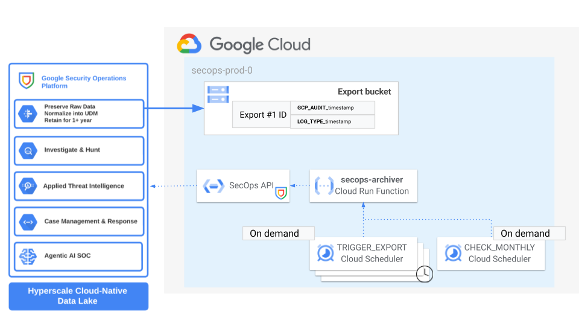

# SecOps Archiver

This blueprint offers a comprehensive and adaptable solution for constructing an automation for exporting raw data from a SecOps tenant to Google Cloud Storage for longer retention. The pipeline is built on top of various Google Cloud products.

## Prerequisites

The [`project.yaml`](./project.yaml) file describes the project-level configuration needed in terms of API activation and IAM bindings.

If you are deploying this inside a FAST-enabled organization, the file can be lightly edited to match your configuration, and then used directly in the [project factory](https://github.com/GoogleCloudPlatform/cloud-foundation-fabric/tree/master/fast/stages/2-project-factory).

This Terraform can of course be deployed using any pre-existing project. In that case use the YAML file to determine the configuration you need to set on the project:

- enable the APIs listed under `services`
- grant the permissions listed under `iam` to the principal running Terraform, either machine (service account) or human


### High level architecture

The following diagram illustrates the high-level design of the solution, which can be adapted to specific requirements via variables and/or simple terraform and Python code customizations:



The use case is a SecOps deployment where there is a need to export data from a SecOps tenant to a GCS bucket for long term retention and/or further analysis.

The solution is based on a custom Python script responsible for implementing the aforementioned logic. The script leverages the new [SecOps API Wrapper](https://github.com/google/secops-wrapper) available also in [PyPi](https://pypi.org/project/secops/).

### Pipeline Steps

- **SecOps Export**: Triggered via the corresponding TRIGGER-EXPORT action. Call [SecOps Export API](https://cloud.google.com/chronicle/docs/reference/rest/v1alpha/projects.locations.instances.dataExports) to trigger raw logs export on a GCS bucket based on either all the log types or one o more of them for a specific time frame. By default, the export will be for the previous month, otherwise the following parameters can be specified to change the time frame:
  * `EXPORT_MONTH` month for the export (format %Y-%m)
- **Check Monthly Export**: Triggered via the corresponding CHECK-MONTHLY-EXPORT action. Check the status of the export for a specific month.

### Limitations

- The pipeline can be schedule to run on a monthly basis or on-demand, being all asynchronous tasks the check for the export should be triggered after the export is completed successfully
- Currently, SecOps export API supports 3 concurrent export requests for each tenant, due to each export request being associated to either all log types or a specific log type this result in no more than 3 log types exported within the same export request.
- Each Export request via SecOps API can process and export up to 100TB of data 

### Deployment

#### Step 0: Cloning the repository

If you want to deploy from your Cloud Shell, click on the image below, sign in
if required and when the prompt appears, click on “confirm”.

[](https://shell.cloud.google.com/cloudshell/editor?cloudshell_git_repo=https%3A%2F%2Fgithub.com%2FGoogleCloudPlatform%2Fcloud-foundation-fabric&cloudshell_workspace=blueprints%2Fthird-party-solutions%2Fwordpress%2Fcloudrun)

Otherwise, in your console of choice:

```bash
git clone REPO_URL
```

Before you deploy the architecture, you will need at least the following
information (for more precise configuration see the Variables section):

* GCP Project ID for SecOps archiver pipeline deployment
* SecOps tenants information:
  * GCP project of SecOps tenant
  * SecOps customer ID for SecOps tenant
  * SecOps deployment region for the tenant
  * **Grant Pipeline SA Chronicle API Editor role on the tenant** (this might be restricted to data export permissions on the tenant)

#### Step 1: Prepare the variables

Once you have the required information, head back to your cloned repository.
Make sure you’re in the directory of this tutorial (where this README is in).

Configure the Terraform variables in your `terraform.tfvars` file.
See sample TF variables in `terraform.tfvars` file as starting point - just
copy them to a new `terraform.tfvars` file and update accordingly.
See the variables documentation below for more information.

#### Step 2: Deploy resources

Initialize your Terraform environment and deploy the resources:

```shell
terraform init
terraform apply
```

#### Step 3: Test solution

Test the solution triggering an export from the Cloud Scheduler page, after few hours (according to the size of the export) logs should be available on secops-export bucket. Please check for any issue during export using the corresponding APIs and the export ID.
<!-- BEGIN TFDOC -->
## Variables

| name | description | type | required | default |
|---|---|:---:|:---:|:---:|
| [prefix](variables.tf#L35) | Prefix used for resource names. | <code>string</code> | ✓ |  |
| [project_id](variables.tf#L54) | Project id that references existing project. | <code>string</code> | ✓ |  |
| [secops_config](variables.tf#L81) | SecOps config. | <code title="object&#40;&#123;&#10;  region      &#61; string&#10;  customer_id &#61; string&#10;  gcp_project &#61; string&#10;&#125;&#41;">object&#40;&#123;&#8230;&#125;&#41;</code> | ✓ |  |
| [cloud_function_config](variables.tf#L17) | Optional Cloud Function configuration. | <code title="object&#40;&#123;&#10;  build_worker_pool_id &#61; optional&#40;string&#41;&#10;  build_sa             &#61; optional&#40;string&#41;&#10;  debug                &#61; optional&#40;bool, false&#41;&#10;  cpu                  &#61; optional&#40;number, 1&#41;&#10;  memory_mb            &#61; optional&#40;number, 2048&#41;&#10;  timeout_seconds      &#61; optional&#40;number, 3600&#41;&#10;  vpc_connector &#61; optional&#40;object&#40;&#123;&#10;    name            &#61; string&#10;    egress_settings &#61; optional&#40;string, &#34;ALL_TRAFFIC&#34;&#41;&#10;  &#125;&#41;&#41;&#10;&#125;&#41;">object&#40;&#123;&#8230;&#125;&#41;</code> |  | <code>&#123;&#125;</code> |
| [project_create_config](variables.tf#L45) | Create project instead of using an existing one. | <code title="object&#40;&#123;&#10;  billing_account &#61; string&#10;  parent          &#61; optional&#40;string&#41;&#10;&#125;&#41;">object&#40;&#123;&#8230;&#125;&#41;</code> |  | <code>null</code> |
| [regions](variables.tf#L59) | Regions: primary for all resources and secondary for clouds scheduler since the latter is available in few regions. | <code title="object&#40;&#123;&#10;  primary   &#61; string&#10;  secondary &#61; string&#10;&#125;&#41;">object&#40;&#123;&#8230;&#125;&#41;</code> |  | <code title="&#123;&#10;  primary   &#61; &#34;europe-west1&#34;&#10;  secondary &#61; &#34;europe-west1&#34;&#10;&#125;">&#123;&#8230;&#125;</code> |
| [schedule_config](variables.tf#L71) | Schedule for triggering data exports and job for checking previous exports results. | <code title="map&#40;object&#40;&#123;&#10;  action    &#61; string&#10;  schedule  &#61; string&#10;  log_types &#61; string&#10;&#125;&#41;&#41;">map&#40;object&#40;&#123;&#8230;&#125;&#41;&#41;</code> |  | <code>&#123;&#125;</code> |

## Outputs

| name | description | sensitive |
|---|---|:---:|
| [function_sa](outputs.tf#L17) | SecOps Archiver function service account. |  |
<!-- END TFDOC -->
## Test

```hcl
module "test" {
  source = "./secops-toolkit/blueprints/secops-archiver"
  secops_config = {
    region      = "europe"
    customer_id = "xxx-xxxxxx-xxxxx"
    gcp_project = "SOURCE_PROJECT_ID"
  }
  prefix     = "pre"
  project_id = "gcp-project-id"
  project_create_config = {
    billing_account = "12345-ABCDE-12345"
  }
  regions = {
    primary   = "europe-west1"
    secondary = "europe-west1"
  }
}
# tftest modules=6 resources=44
```
