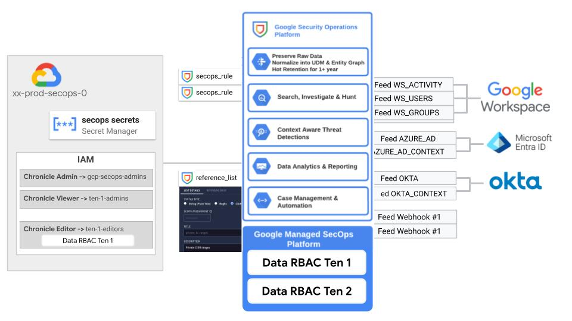

# SecOps Instance

This blueprint allows automated configuration of SecOps instance at both infrastructure and application level.

The following diagram illustrates the high-level design of SecOps instance configuration in both GCP and SecOps instance, which can be adapted to specific requirements via variables.

<p align="center">
  
</p>

<!-- BEGIN TOC -->
- [Design overview and choices](#design-overview-and-choices)
  - [Custom Roles](#custom-roles)
  - [Provider and Terraform variables](#provider-and-terraform-variables)
  - [Impersonating the automation service account](#impersonating-the-automation-service-account)
  - [Variable configuration](#variable-configuration)
  - [Running the blueprint](#running-the-blueprint)
- [Customizations](#customizations)
  - [Data RBAC](#data-rbac)
  - [SecOps rules and reference list management](#secops-rules-and-reference-list-management)
  - [Google Workspace integration](#google-workspace-integration)
- [Files](#files)
- [Variables](#variables)
- [Outputs](#outputs)
<!-- END TOC -->

## Design overview and choices

The general idea behind this stage is to configure a single SecOps instance for a specific environment with configurations both on SecOps leveraging terraform resources (where available) and `restful_resource` for interacting with the new [SecOps APIs](https://cloud.google.com/chronicle/docs/reference/rest).

Some high level features of the current version of the stage are:

- API/Services enablement
- Data RBAC configuration with labels and scopes
- IAM setup for the SecOps instance based on groups from Cloud Identity or WIF (with supports for Data RBAC)
- Detection Rules and reference lists management via terraform (leveraging [secops-rules](../../modules/secops-rules) module)
- API Key setup for Webhook feeds
- Integration with Workspace for alerts and logs ingestion via SecOps Feeds

### Custom Roles

This blueprint offer a set of custom roles for Google SecOps, those roles are tailor-made permission sets that allow you to grant granular access to security features. 
Instead of relying on broad, predefined roles, you can apply the principle of least-privilege, giving users access to only the tools and data they need to perform their specific duties.

Please find below the predefined set of custom roles available in the blueprint in the folder [custom_roles](./data/custom_roles) as YAML files. Those YAML files are consumed by the project factory to generate the corresponding custom roles on the GCP project. If you are not using such a blueprint please feel free to leverage the permissions in the YAML file to set up your own custom roles.

| Resource | Global Admin | SecOps Sub-Org Admin | SecOps Sub-Org Onboarding & Feed Management | SecOps Sub-Org Detection Engineering | Custom IAM Roles (SecOps Scoped Detection Engineering) | SecOps Scoped Detection Viewer | SecOps Scoped Onboarding |
| :--- | :--- | :--- | :--- | :--- | :--- | :--- | :--- |
| **Global Scope** | | | | | | | |
| GlobalDataAccessScopes | view | view | view | view | view | view | view |
| Basic Information | view | view | view | view | view | view | view |
| Projects | view | view | view | view | view | view | view |
| errorNotificationConfigs | view | view | view | x | x | x | view |
| userNotificationConfigs | view | view | view | view | view | view | view |
| **Data Ingestion** | | | | | | | |
| DataAccessLatest | view | view | view | view | view | view | view |
| DataAccessScopes | view | view | view | view | view | view | view |
| **Data Export** | | | | | | | |
| DataExports | admin | admin | x | x | x | x | x |
| dataTap | admin | admin | x | x | x | x | x |
| **Forwarder management** | | | | | | | |
| Forwarders | admin | admin | admin | x | x | x | admin |
| **Feed management** | | | | | | | |
| Feeds | admin | admin | admin | x | x | x | admin |
| FeedPivots | admin | admin | admin | x | x | x | admin |
| FeedSourceAccounts | admin | admin | admin | x | x | x | admin |
| FeedSourceTypeSchemas | admin | admin | admin | x | x | x | admin |
| GCTI | admin | admin | x | admin | admin | view | x |
| LogTypes | admin | admin | admin | x | x | x | admin |
| LogTypeSchemas | admin | admin | admin | x | x | x | admin |
| LogTypeVerifiers | admin | admin | admin | x | x | x | admin |
| IngestionLabels | admin | admin | admin | x | x | x | admin |
| IngestionLogNameRegexes | admin | admin | admin | x | x | x | admin |
| **Parser management** | | | | | | | |
| Parsers | admin | admin | admin | x | x | x | admin |
| ParserExtensions | admin | admin | admin | x | x | x | admin |
| ValidationReports | admin | admin | admin | x | x | x | admin |
| ExtensionValidationReports | admin | admin | admin | x | x | x | admin |
| ParsingErrors | admin | admin | admin | x | x | x | admin |
| ValidationErrors | admin | admin | admin | x | x | x | admin |
| **Curated Detections** | | | | | | | |
| CuratedRuleSets | admin | admin | view | admin | admin | view | view |
| CuratedRuleSetDeployments | admin | admin | x | admin | admin | x | x |
| CuratedRuleSetCategories | admin | admin | view | admin | admin | view | view |
| FindingRefinements | admin | admin | x | admin | admin | view | x |
| FindingRefinementDeployments | admin | admin | x | admin | admin | x | x |
| **Risk Analytics** | | | | | | | |
| RiskConfigs | view | view | view | view | x | x | view |
| RiskEnrich | view | view | view | view | x | x | view |
| EnrichmentControls | view | view | view | view | x | x | view |
| FindingsGraphs | view | view | view | view | x | x | view |
| **Rules** | | | | | | | |
| Rules | admin | admin | view | admin | admin | view | view |
| RuleDeployments | admin | admin | x | admin | admin | x | x |
| RuleExecutionErrors | admin | admin | view | admin | admin | view | view |
| RuleErrors | admin | admin | view | admin | admin | view | view |
| IocMatches | admin | admin | x | admin | admin | x | x |
| IocStats | admin | admin | x | admin | admin | x | x |
| Iocs | admin | admin | x | admin | admin | x | x |
| RetrohuntCollections | admin | admin | x | admin | admin | x | x |
| **Reference List resources** | | | | | | | |
| ReferenceLists | admin | admin | view | admin | admin | view | view |
| **Data Tables resources** | | | | | | | |
| DataTables | admin | admin | view | admin | admin | view | view |
| DataTableRows | admin | admin | view | admin | admin | view | view |
| DataTableOperationErrors | admin | admin | view | admin | admin | view | view |
| **Dashboards and UDMs** | | | | | | | |
| Dashboards | admin | admin | view | admin | admin | view | view |
| DashboardReports | admin | admin | x | admin | admin | view | x |
| DashboardQueries | admin | admin | x | admin | admin | view | x |
| **Search** | | | | | | | |
| Events | admin | admin | view | admin | admin | view | view |
| Entities | admin | admin | view | admin | admin | view | view |
| **Operating resources** | | | | | | | |
| Operations | view | view | view | view | view | view | view |
| **User data resources** | | | | | | | |
| SearchQueries | view | view | view | view | view | view | view |
| PreferenceData | view | view | view | view | view | view | view |
| **Gemini** | | | | | | | |
| AI | view | view | view | view | view | view | view |
| Conversations | view | view | view | view | view | view | view |
| Messages | view | view | view | view | view | view | view |
| **Multi-tenancy** | | | | | | | |
| MySiemclDirectories | view | view | view | view | view | view | view |
| **Legacy resources** | | | | | | | |
| Detections | admin | admin | x | admin | admin | view | x |

### Provider and Terraform variables

### Impersonating the automation service account

It is recommended to adopt a provider file that leverages impersonation to run with a dedicated stage's automation service account's credentials. The groups operating such a script should have the necessary IAM bindings in place to do that, so make sure the current user is a member of one of those groups.

### Variable configuration

Variables in this blueprint control this script's behaviour and customizations, and can to be set in a custom `terraform.tfvars` file (a sample `terraform.tfvars.sample` was provided for easier adoption of this automation).

The latter set is explained in the [Customization](#customizations) sections below, and the full list can be found in the [Variables](#variables) table at the bottom of this document.

### Running the blueprint

Once provider and variable values are in place and the correct user is configured, the stage can be run:

```bash
terraform init
terraform apply
```

## Customizations

This blueprint is designed with few basic integrations provided out of the box which can be customized as per the following sections.

### Data RBAC

This stage supports configuration of [SecOps Data RBAC](https://cloud.google.com/chronicle/docs/administration/datarbac-overview) using two separate variables:

- `secops_data_rbac_config`: specifies Data RBAC [label and scopes](https://cloud.google.com/chronicle/docs/administration/configure-datarbac-users) in Google SecOps
- `secops_iam`: defines SecOps IAM configuration in {PRINCIPAL => {roles => [ROLES], scopes => [SCOPES]}} format referencing previously defined scopes. When scope is populated a [IAM condition](https://cloud.google.com/chronicle/docs/administration/configure-datarbac-users#assign-scope-to-users) restrict access to those scopes.

Example of a Data RBAC configuration is reported below.

```hcl
secops_data_rbac_config = {
  labels = {
    google = {
      description = "Google logs"
      label_id    = "google"
      udm_query   = "principal.hostname=\"google.com\""
    }
  }
  scopes = {
    google = {
      description = "Google logs"
      scope_id    = "gscope"
      allowed_data_access_labels = [{
        data_access_label = "google"
      }]
    }
  }
}
secops_iam = {
  "user:bruzzechesse@google.com" = {
    roles  = ["SecOpsScopedOnboaardingEngineer"]
    scopes = ["gscope"]
  }
}
# tftest skip
```

Such a variable supports assigning principals custom roles defined via the project factory by simply referencing the role name as per the previous example.
Be aware that just "Scoped" roles are supported for Data RBAC configuration.

### SecOps rules and reference list management

This stage leverages the [secops-rules](../../modules/secops-rules) for automated SecOps rules and reference list deployment via Terraform.

By default, the stage will try to deploy sample rule and reference list available in the [rules](./data/rules) and [reference_lists](./data/reference_lists) folders according to the configuration files `secops_rules.yaml` and `secops_reference_lists.yaml`.

The configuration can be updated via the `factory_config` variable as per the `secops-rules` module [README.md](../../modules/secops-rules/README.md).

### Google Workspace integration

The stage supports automatic integration of Google Workspace as a SecOps source leveraging [SecOps Feeds](https://cloud.google.com/chronicle/docs/ingestion/default-parsers/collect-workspace-logs#configure_a_feed_in_to_ingest_logs) integration.

Integration is enabled via the `workspace_integration_config` variable as per the following sample:

```hcl
workspace_integration_config = {
  delegated_user        = "secops-feed@..."
  workspace_customer_id = "CXXXXXXX"
}
# tftest skip
```

Where `delegated_user` should be the email of the user created in Cloud Identity following the configuration instructions available [here](https://cloud.google.com/chronicle/docs/ingestion/default-parsers/collect-workspace-logs#configure_a_feed_in_to_ingest_logs).

Please be aware the Service Account Client ID needed during domain wide delegation setup is available in the key of the service account stored in Secret Manager.

<!-- TFDOC OPTS files:1 show_extra:1 exclude:3-secops-dev-providers.tf -->
<!-- BEGIN TFDOC -->
## Files

| name | description | modules | resources |
|---|---|---|---|
| [feeds.tf](./feeds.tf) | None |  | <code>restful_operation</code> · <code>restful_resource</code> |
| [main.tf](./main.tf) | Project and IAM. | <code>project</code> | <code>google_apikeys_key</code> |
| [monitoring.tf](./monitoring.tf) | Cloud Monitoring. |  | <code>google_monitoring_alert_policy</code> · <code>google_monitoring_notification_channel</code> |
| [outputs.tf](./outputs.tf) | Module outputs. |  |  |
| [secops-providers.tf](./secops-providers.tf) | None |  |  |
| [secops.tf](./secops.tf) | None | <code>secops-data-rbac</code> · <code>secops-rules</code> |  |
| [secrets.tf](./secrets.tf) | None | <code>secret-manager</code> |  |
| [variables.tf](./variables.tf) | Module variables. |  |  |
| [versions.tf](./versions.tf) | Version pins. |  |  |
| [workspace.tf](./workspace.tf) | None | <code>iam-service-account</code> | <code>google_service_account_key</code> · <code>restful_resource</code> |

## Variables

| name | description | type | required | default | producer |
|---|---|:---:|:---:|:---:|:---:|
| [monitoring_config](variables.tf#L23) | Cloud Monitoring configuration for SecOps. | <code title="object&#40;&#123;&#10;  enabled             &#61; optional&#40;bool, false&#41;&#10;  notification_emails &#61; optional&#40;list&#40;string&#41;, &#91;&#93;&#41;&#10;&#125;&#41;">object&#40;&#123;&#8230;&#125;&#41;</code> | ✓ |  |  |
| [project_id](variables.tf#L40) | Project id that references existing project. | <code>string</code> | ✓ |  |  |
| [secops_tenant_config](variables.tf#L111) | SecOps Tenant configuration. | <code title="object&#40;&#123;&#10;  customer_id &#61; string&#10;  region      &#61; string&#10;&#125;&#41;">object&#40;&#123;&#8230;&#125;&#41;</code> | ✓ |  |  |
| [_tests](variables.tf#L17) | Dummy variable populated by tests pipeline. | <code>bool</code> |  | <code>false</code> |  |
| [project_create_config](variables.tf#L31) | Create project instead of using an existing one. | <code title="object&#40;&#123;&#10;  billing_account &#61; string&#10;  parent          &#61; optional&#40;string&#41;&#10;&#125;&#41;">object&#40;&#123;&#8230;&#125;&#41;</code> |  | <code>null</code> |  |
| [regions](variables.tf#L45) | Region definitions. | <code title="object&#40;&#123;&#10;  primary   &#61; string&#10;  secondary &#61; string&#10;&#125;&#41;">object&#40;&#123;&#8230;&#125;&#41;</code> |  | <code title="&#123;&#10;  primary   &#61; &#34;europe-west8&#34;&#10;  secondary &#61; &#34;europe-west1&#34;&#10;&#125;">&#123;&#8230;&#125;</code> |  |
| [secops_data_rbac_config](variables.tf#L57) | SecOps Data RBAC scope and labels config. | <code title="object&#40;&#123;&#10;  labels &#61; optional&#40;map&#40;object&#40;&#123;&#10;    description &#61; string&#10;    label_id    &#61; string&#10;    udm_query   &#61; string&#10;  &#125;&#41;&#41;, &#123;&#125;&#41;&#10;  scopes &#61; optional&#40;map&#40;object&#40;&#123;&#10;    description &#61; string&#10;    scope_id    &#61; string&#10;    allowed_data_access_labels &#61; optional&#40;list&#40;object&#40;&#123;&#10;      data_access_label &#61; optional&#40;string&#41;&#10;      log_type          &#61; optional&#40;string&#41;&#10;      asset_namespace   &#61; optional&#40;string&#41;&#10;      ingestion_label &#61; optional&#40;object&#40;&#123;&#10;        ingestion_label_key   &#61; string&#10;        ingestion_label_value &#61; optional&#40;string&#41;&#10;      &#125;&#41;&#41;&#10;    &#125;&#41;&#41;, &#91;&#93;&#41;&#10;    denied_data_access_labels &#61; optional&#40;list&#40;object&#40;&#123;&#10;      data_access_label &#61; optional&#40;string&#41;&#10;      log_type          &#61; optional&#40;string&#41;&#10;      asset_namespace   &#61; optional&#40;string&#41;&#10;      ingestion_label &#61; optional&#40;object&#40;&#123;&#10;        ingestion_label_key   &#61; string&#10;        ingestion_label_value &#61; optional&#40;string&#41;&#10;      &#125;&#41;&#41;&#10;    &#125;&#41;&#41;, &#91;&#93;&#41;&#10;  &#125;&#41;&#41;, &#123;&#125;&#41;&#10;&#125;&#41;">object&#40;&#123;&#8230;&#125;&#41;</code> |  | <code>&#123;&#125;</code> |  |
| [secops_group_principals](variables.tf#L91) | Groups ID in IdP assigned to SecOps admins, editors, viewers roles. | <code title="object&#40;&#123;&#10;  admins  &#61; optional&#40;list&#40;string&#41;, &#91;&#93;&#41;&#10;  editors &#61; optional&#40;list&#40;string&#41;, &#91;&#93;&#41;&#10;  viewers &#61; optional&#40;list&#40;string&#41;, &#91;&#93;&#41;&#10;&#125;&#41;">object&#40;&#123;&#8230;&#125;&#41;</code> |  | <code>&#123;&#125;</code> |  |
| [secops_iam](variables.tf#L101) | SecOps IAM configuration in {PRINCIPAL => {roles => [ROLES], scopes => [SCOPES]}} format. | <code title="map&#40;object&#40;&#123;&#10;  roles  &#61; list&#40;string&#41;&#10;  scopes &#61; optional&#40;list&#40;string&#41;&#41;&#10;&#125;&#41;&#41;">map&#40;object&#40;&#123;&#8230;&#125;&#41;&#41;</code> |  | <code>&#123;&#125;</code> |  |
| [third_party_integration_config](variables.tf#L119) | SecOps Feeds configuration for Workspace logs and entities ingestion. | <code title="object&#40;&#123;&#10;  azure_ad &#61; optional&#40;object&#40;&#123;&#10;    oauth_credentials &#61; object&#40;&#123;&#10;      client_id     &#61; string&#10;      client_secret &#61; string&#10;    &#125;&#41;&#10;    retrieve_devices &#61; optional&#40;bool, true&#41;&#10;    retrieve_groups  &#61; optional&#40;bool, true&#41;&#10;    tenant_id        &#61; string&#10;  &#125;&#41;&#41;&#10;  okta &#61; optional&#40;object&#40;&#123;&#10;    auth_header_key_values     &#61; map&#40;string&#41;&#10;    hostname                   &#61; string&#10;    manager_id_reference_field &#61; string&#10;  &#125;&#41;&#41;&#10;  workspace &#61; optional&#40;object&#40;&#123;&#10;    customer_id    &#61; string&#10;    delegated_user &#61; string&#10;    applications &#61; optional&#40;list&#40;string&#41;, &#91;&#34;access_transparency&#34;, &#34;admin&#34;, &#34;calendar&#34;, &#34;chat&#34;, &#34;drive&#34;, &#34;gcp&#34;,&#10;      &#34;gplus&#34;, &#34;groups&#34;, &#34;groups_enterprise&#34;, &#34;jamboard&#34;, &#34;login&#34;, &#34;meet&#34;, &#34;mobile&#34;, &#34;rules&#34;, &#34;saml&#34;, &#34;token&#34;,&#10;      &#34;user_accounts&#34;, &#34;context_aware_access&#34;, &#34;chrome&#34;, &#34;data_studio&#34;, &#34;keep&#34;,&#10;    &#93;&#41;&#10;  &#125;&#41;&#41;&#10;&#125;&#41;">object&#40;&#123;&#8230;&#125;&#41;</code> |  | <code>&#123;&#125;</code> |  |
| [webhook_feeds_config](variables.tf#L148) | SecOps Webhook feeds config. | <code title="map&#40;object&#40;&#123;&#10;  display_name &#61; optional&#40;string&#41;&#10;  log_type     &#61; string&#10;&#125;&#41;&#41;">map&#40;object&#40;&#123;&#8230;&#125;&#41;&#41;</code> |  | <code>&#123;&#125;</code> |  |

## Outputs

| name | description | sensitive | consumers |
|---|---|:---:|---|
| [project_id](outputs.tf#L15) | SecOps project id. |  |  |
<!-- END TFDOC -->
