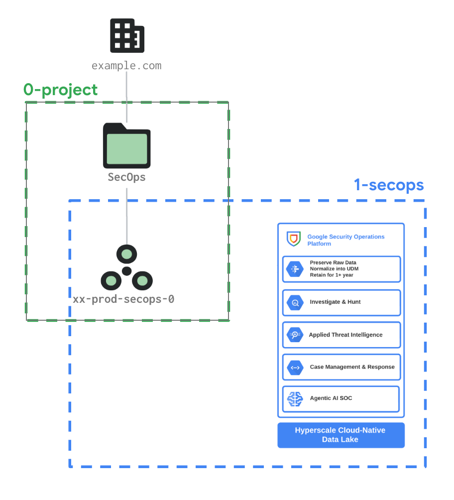

# SecOps Toolkit Foundation

Setting up a production-ready Google SecOps tenant is often a time-consuming process, especially in large organizations or organizations already using Google Cloud Platform who needs to accomodate the Google SecOps product. SecOps Toolkit Foundations in SecOps Toolkit aims to speed up this process via two complementary goals. On the one hand, SecOps Toolkit Foundations automation seamlessly integrates with the customer GCP organization, whether this is a brand new organization or part of a larger enterprise one. Secondly, we provide a reference implementation of the SecOps Foundations design using best practices and Terraform, based on our experience with our customers.

SecOps Toolkit Foundations comes from engineers in Google Cloud's Professional Services Organization, with a combined experience of years solving the typical technical problems faced by Google SecOps/Chronicle customers. While every SecOps deployment has specific requirements, many common issues arise repeatedly. Solving those issues correctly from the beginning is key to a robust and scalable SecOps setup. It's those common issues and their solutions that SecOps Toolkit Foundations aims to collect and present coherently.

SecOps Toolkit Foundations includes many customization points making it an ideal blueprint for organizations of all sizes, ranging from startups to the largest companies for different SecOps deployment models (Single Tenant/Multi Tenant) and number of environments (Single Environment or Multiple Environments).

## Guiding principles

### Integration between GCP and SecOps

As Google SecOps runs in Google Cloud Platform, SecOps Toolkit Foundation is designed to be used by organizations starting out with Google Cloud Platform as well as those already using Google Cloud Platform as a part of a larger enterprise one. We provide a reference implementation of the SecOps Toolkit Foundation design using best practices and Terraform, based on our experience with our customers which may also benefit from other offerings, like the [Google Cloud Foundation Fabric](https://github.com/GoogleCloudPlatform/cloud-foundation-fabric) (FAST), in order to rapidly deploy a production-ready Google SecOps.

While the SecOps Toolkit Foundation address some of the best practises related to least privileges and proper segreagation of duties, it does not address a proper landing zone deployment, which is typically handled by [Fabric FAST](https://github.com/GoogleCloudPlatform/cloud-foundation-fabric). In fact, FAST handles the overall GCP organization deployment, while SecOps Toolkit Foundation is focused on the SecOps part of the GCP organization. It is however fully compatible with FAST, and can be used in conjunction with FAST to provide a complete SecOps solution.

### Security-first design

Security was, from the beginning, one of the most critical elements in the design of SecOps Toolkit Foundations. Many of FAST's design decisions aim to build the foundations of a secure organization. In fact, the first stage deals mainly with the organization-wide security setup, and the second stage partitions the organization hierarchy and puts guardrails in place for each hierarchy branch.

SecOps Toolkit Foundations also aims to minimize the number of permissions granted to principals according to the security-first approach previously mentioned. We achieve this through the meticulous use of groups, service accounts, [Workforce Identity Federation](https://cloud.google.com/iam/docs/workload-identity-federation) principals, custom roles, and [Cloud IAM Conditions](https://cloud.google.com/iam/docs/conditions-overview), among other things.

### Use of factories

Being originated and highly dependant of the [Google Cloud Foundation Toolkit](https://github.com/GoogleCloudPlatform/cloud-foundation-fabric), SecOps Toolkit Foundations is also built using the same resource factory paradigm. A resource factory consumes a simple representation of a resource (e.g., in YAML) and deploys it (e.g., using Terraform). Used correctly, factories can help decrease the management overhead of large-scale configuration deployments. See "[Resource Factories: A descriptive approach to Terraform](https://medium.com/google-cloud/resource-factories-a-descriptive-approach-to-terraform-581b3ebb59c)" for more details and the rationale behind factories.

SecOps Toolkit Foundations uses YAML-based factories to deploy VPC Service Control configuration in stage [0-project](./stages/0-project/) and Rules, Data Tables, Custom Roles and more in stage [2-secops](./stages/2-secops/).

## Implementation

SecOps Toolkit Foundations hinerits from [Cloud Foundation Fabric](https://github.com/GoogleCloudPlatform/cloud-foundation-fabric) the stages paradigm, which is well suitable with the SecOps provisioning process. Overall SecOps provisioning is reported in the following documentation page and consists of 3 steps:

1. Environment preparation
  - Grant permissions to perform onboarding.
  - Set up an Assured Workloads folder (optional).
  - Configure a Google Cloud project.
  - Configure an identity provider
2. Onboard a new Google SecOps instance
  - The Google system sends a Google SecOps onboarding invitation email to your onboarding SME. This email includes an activation link to initiate the setup process.
  - Complete the setup process following the instructions in the [Official Doc](https://docs.cloud.google.com/chronicle/docs/onboard/link-chronicle-cloud#instance-to-new-subscription).
3. SecOps Configuration
  - Assign proper Feature RBAC roles to give people access to SecOps
  - Start configuring Google SecOps

While the second step of this process cannot be automated and requires human interaction to complete the setup process following the instructions in the [Official Doc](https://docs.cloud.google.com/chronicle/docs/onboard/link-chronicle-cloud#instance-to-new-subscription), the first and third steps are fully automated via Terraform by leveraging this SecOps Toolkit Foundation and respectively map to stages [0-project](./stages/0-project/) and [1-secops](./stages/1-secops/) of this repository.

Below is a diagram of the SecOps Toolkit Foundations stages and how they map with the configurations of GCP folder/project as well as SecOps configurations:

High level the reesponsability of each stage is as follows:

0-project: This stage is responsible for setting up the GCP project (and optionally a SecOps folder underneath the organization) and, optionally, further configurations like the VPC Service Controls.

1-secops: This stage is responsible for bootstrapping the new Google SecOps instance with the required configurations to operate (e.g. Access with IAM and RBAC, Custom Roles, Ingestion credentials, SOAR Environments etc.) based on Google Professional Services best practices.

For more information on each stage please refer to the dedicated README in the stage folder.
