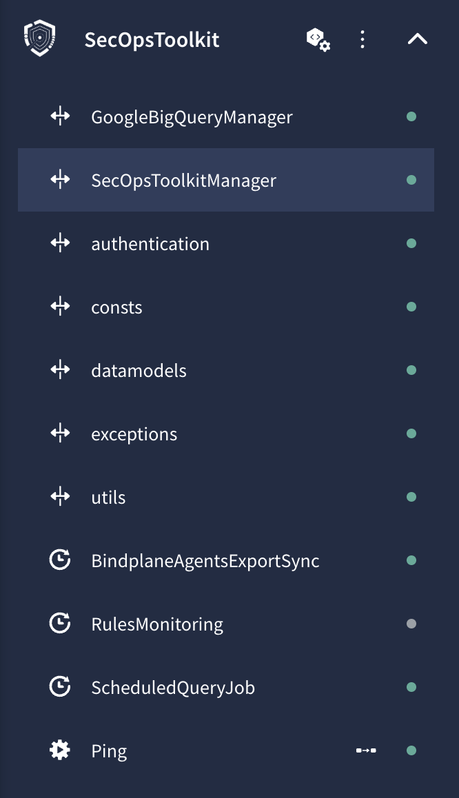

# Google SecOps SOAR Custom Integrations

This directory contains custom Google Security Operations (SOAR) integrations and automation utilities designed to extend SecOps capabilities, automate administrative tasks, and streamline monitoring across your SecOps environment.

---

## 📦 Available Integrations

### 1. `SecOpsToolkit`
The **SecOpsToolkit** integration provides essential administrative actions and automated background jobs for health monitoring, data table management, and log/agent inventory synchronization.



#### ⚡ Actions
- **`Ping`**: Verifies connectivity and authentication credentials against the Google SecOps (Chronicle) API endpoints.

#### ⏱️ Jobs
- **[`ScheduledQueryJob`](#1-scheduledqueryjob-setup--configuration)**:
  - Automatically executes UDM search queries on a recurring schedule based on a configured `Search ID`.
  - Supports configurable lookback window (`Window Size` in hours, default: `720` hours / 30 days).
  - Materializes query results into a target Data Table and tracks the Long-Running Operation (LRO) until completion.
- **[`RulesMonitoring`](#2-rulesmonitoring-setup--configuration)**:
  - Continuously monitors detection rules across the tenant for `PAUSED` or `LIMITED` execution states.
  - Keeps track of notified rules in a dedicated SecOps Data Table (`rules_monitoring`) with a 7-day TTL to prevent duplicate notifications.
  - Sends structured HTML alert emails to notification lists (`Recipient Emails`) with deep links directly to the impacted tenant console (`Tenant URL`).
- **[`BindplaneAgentsExportSync`](#3-bindplaneagentsexportsync-setup--configuration)**:
  - Automatically discovers and synchronizes BindPlane agent inventories across multiple projects and configurations.
  - Materializes inventory data to Google BigQuery datasets and synchronizes them into SecOps Data Tables (`bindplane_agents`).

---

## 🔑 Prerequisites & Authentication Setup

Before configuring or executing actions and jobs in the **SecOpsToolkit** integration, ensure your Google Cloud Service Account is provisioned with the appropriate authentication method and IAM permissions.

### 1. Authentication Methods

#### 🟢 Method A: Workload Identity Federation (Recommended)
Workload Identity Federation is the **recommended and most secure approach**. It uses short-lived, temporary access tokens via Service Account Impersonation, eliminating the security risks associated with storing and rotating long-lived static JSON private keys.

- **Documentation**: [Authenticate Google Chronicle with Workload Identity (Official Guide)](https://cloud.google.com/chronicle/docs/soar/marketplace-integrations/google-chronicle#authentication-with-a-workload-identity-recommended)
- **Setup Steps**:
  1. Create a dedicated Google Cloud Service Account in your project (e.g. `secops-soar-sa@<PROJECT_ID>.iam.gserviceaccount.com`).
  2. In Google SecOps SOAR, open the **SecOpsToolkit** integration settings and set the **`Workload Identity Email`** parameter to your Service Account email (leave **`User's Service Account`** empty).
  3. Identify your Google SecOps instance identity email (e.g., `gke-init-python@<PROJECT>.iam.gserviceaccount.com` or `soar-python@<TENANT_PROJECT>.iam.gserviceaccount.com`).
  4. In the Google Cloud Console, navigate to **IAM & Admin** > **Service Accounts**, select your Service Account, and grant the **Service Account Token Creator** (`roles/iam.serviceAccountTokenCreator`) role to the SecOps instance identity email.

#### 🟡 Method B: Service Account JSON Key (Fallback)
If Workload Identity Federation is not feasible in your environment:
- **Documentation**: [Authenticate Google Chronicle with a Service Account JSON key](https://cloud.google.com/chronicle/docs/soar/marketplace-integrations/google-chronicle#authentication-with-a-service-account-json-key)
- **Setup Steps**:
  1. Generate and download a JSON private key for your Service Account.
  2. Paste the full JSON key string into the **`User's Service Account`** parameter in the integration settings (leave **`Workload Identity Email`** empty).

---

### 2. Required IAM Roles & Permissions

The Service Account must be granted sufficient permissions on the Google Cloud project where Google SecOps is provisioned.

#### 🛡️ Custom Role (Least Privilege - Recommended)
Create a custom IAM role containing the following minimum permissions:

```text
chronicle.dataTableOperationErrors.get
chronicle.dataTableRows.asyncBulkAppend
chronicle.dataTableRows.asyncBulkCreate
chronicle.dataTableRows.asyncBulkDelete
chronicle.dataTableRows.asyncBulkReplace
chronicle.dataTableRows.asyncBulkUpdate
chronicle.dataTableRows.bulkCreate
chronicle.dataTableRows.bulkDelete
chronicle.dataTableRows.bulkGet
chronicle.dataTableRows.bulkReplace
chronicle.dataTableRows.bulkUpdate
chronicle.dataTableRows.create
chronicle.dataTableRows.delete
chronicle.dataTableRows.get
chronicle.dataTableRows.list
chronicle.dataTableRows.update
chronicle.dataTables.bulkCreateDataTableAsync
chronicle.dataTables.create
chronicle.dataTables.get
chronicle.dataTables.list
chronicle.dataTables.update
chronicle.globalDataAccessScopes.permit
chronicle.instances.get
chronicle.legacies.legacyFetchUdmSearchView
chronicle.legacies.legacySearchEnterpriseWideIoCs
chronicle.operations.get
chronicle.operations.list
chronicle.operations.wait
chronicle.referenceLists.get
chronicle.referenceLists.list
chronicle.referenceLists.verifyReferenceList
chronicle.ruleDeployments.get
chronicle.ruleDeployments.list
chronicle.rules.get
chronicle.rules.list
chronicle.rules.listRevisions
chronicle.searchQueries.get
chronicle.searchQueries.list
chronicle.searchSessions.search
```

#### 📦 Predefined Role (Fallback)
If custom roles are not used or in case of permission issues, assign the predefined **Chronicle API Admin** (`roles/chronicle.admin`) role to the Service Account.

---

## 🚀 Deployment Methods

You can deploy integrations into your Google SecOps SOAR instance either **manually via the SOAR Web UI** or **automatically using the Python CLI script**.

---

### Method 1: Automated Deployment via Python Script (Recommended)

The [`upload_integration.py`](./upload_integration.py) script packages the integration and uploads it directly to your SecOps instance using the [Google SecOps Integrations Import API](https://docs.cloud.google.com/chronicle/docs/reference/rest/v1alpha/projects.locations.instances.integrations/import).

#### 1. Install Dependencies
```bash
pip install -r requirements.txt
```

#### 2. Configure Environment Variables
Copy the `.env.example` template into `.env` and fill in your SecOps tenant details:
```bash
cp .env.example .env
```

Edit `.env`:
```env
SECOPS_PROJECT_ID=my-secops-gcp-project
SECOPS_LOCATION=europe
SECOPS_INSTANCE_ID=9e7b4e0e-bcba-4e16-923f-ed6fe97bc389

# Optional: Path to GCP Service Account JSON key (uses Application Default Credentials / gcloud if omitted)
# GOOGLE_APPLICATION_CREDENTIALS=/path/to/sa-key.json
```

#### 3. Run the Import Script
Deploy the default integration (`SecOpsToolkit`):
```bash
python upload_integration.py
```

Deploy a specific integration by name:
```bash
python upload_integration.py --integration SecOpsToolkit
```

Deploy using explicit command-line arguments (overriding `.env`):
```bash
python upload_integration.py \
  --integration SecOpsToolkit \
  --project my-secops-gcp-project \
  --location europe \
  --instance 9e7b4e0e-bcba-4e16-923f-ed6fe97bc389 \
  --service-account /path/to/sa-key.json
```

List all available integrations in this repository:
```bash
python upload_integration.py --list
```

---

### Method 2: Manual Deployment via Web UI

If you prefer deploying manually through the Google SecOps console:

#### 1. Create the ZIP Archive
Create a ZIP file containing the **contents** of the integration directory (the root of the archive must directly contain `Integration-<Name>.def`, `Managers/`, `ActionsDefinitions/`, etc.):

```bash
cd SecOpsToolkit
zip -r ../SecOpsToolkit.zip . -x "*.DS_Store" "*__pycache__*" "*.pyc"
cd ..
```

#### 2. Upload to SecOps SOAR
1. Open the **Google SecOps Console**.
2. Navigate to **SOAR Settings** > **Integrations**.
3. Click **Upload Integration** (or the import icon).
4. Select the generated `SecOpsToolkit.zip` file.
5. Once uploaded, open the integration configuration tab and configure:
   - **`API Root`**: `https://<region>-chronicle.googleapis.com/v1alpha/projects/<project>/locations/<location>/instances/<instance>`
   - **`Workload Identity Email`** or **`User's Service Account`**
   - **`Verify SSL`**: `true`
6. Click **Save** and **Test Connectivity** (Ping action).

---

## ⚙️ SOAR Jobs Setup & Configuration

Custom jobs run autonomously on recurring schedules within Google SecOps SOAR to perform synchronization, health auditing, and automated query materialization.

---

### 1. `ScheduledQueryJob` Setup & Configuration

The **`ScheduledQueryJob`** automates the periodic execution of UDM search queries by fetching a saved search, running the search over a configurable rolling lookback window, and materializing the query results into a target Google SecOps Data Table using the YARA-L `export:` syntax.

#### 🔄 Workflow
1. Retrieves the query definition from Google SecOps using the provided **`Search ID`** via the Search API.
2. Calculates the query time window backwards from the current execution time/midnight by subtracting the **`Window Size`** (in hours).
3. Executes an asynchronous UDM search operation (`chronicle.searchSessions.search`).
4. Tracks the Long-Running Operation (LRO) until completion, writing the outcome variables to the destination Data Table and reporting the number of materialized rows.

#### 📋 Prerequisites & Saved Search Creation
For the job to execute successfully, you must create a saved search and share it with your organization:

1. **Construct the YARA-L Query with Export Syntax**:
   - In the Google SecOps console, navigate to **Search**.
   - Write your YARA-L query. To populate a Data Table, include an `export:` section referencing the destination table with `%<table_name>.write_row(...)`:
     ```yara
     events:
       $e.metadata.event_type = "USER_LOGIN"
       $e.security_result.action = "ALLOW"
     outcome:
       $user = $e.principal.user.userid
       $ip = $e.target.ip[0]
       $timestamp = $e.metadata.event_timestamp.seconds
     export:
       %successful_logins.write_row(
         user: $user,
         ip: $ip,
         first_seen: $timestamp
       )
     ```
     *(Note: Ensure the destination Data Table exists or has corresponding columns configured beforehand).*

2. **Save the Search**:
   - Click **Save Search** and provide a title. Note the resulting search title or ID.

3. **⚠️ Mandatory: Share the Saved Search with Your Organization**:
   - By default, saved searches are private to the author. The SOAR Service Account / Workload Identity **will not have access** to private searches and will fail with a `404` or `403` error.
   - Go to **Search** > **Search Manager** (or click the **Saved** tab).
   - Find your search in the list, click **More** (`more_horiz` / `⋮`) on the right side, and select **Share With Your Organization**.
   - Confirm the dialog. The search will now display the **Shared** tag, allowing the API and SOAR job to access it.
   - *References*: [Google SecOps Documentation: Share a search](https://cloud.google.com/chronicle/docs/investigation/udm-search#share-a-search) and [Write results from YARA-L queries to data tables](https://cloud.google.com/chronicle/docs/investigation/data-tables#write-results-from-yara-l-queries-to-data-tables).

#### 🛠️ Job Parameters
| Parameter | Type | Mandatory | Default | Description |
| :--- | :--- | :--- | :--- | :--- |
| **`User ID`** | String | Yes | `me` | Identity context for the query search session (default: `me`). |
| **`Search ID`** | String | Yes | `search` | Identifier or name of the shared Saved Search to execute. |
| **`Window Size`** | Integer | No | `720` | Lookback window in hours calculated backwards from execution time (e.g. `720` = 30 days, `168` = 7 days, `24` = 1 day). |

---

### 2. `RulesMonitoring` Setup & Configuration

The **`RulesMonitoring`** job continuously audits all detection rules and rule deployments across your tenant to identify rules that have transitioned into `LIMITED` (execution restricted due to exceeding detection quotas) or `PAUSED` states.

#### 🔄 Workflow
1. Calls `rules.list` and `ruleDeployments.list` to retrieve active detection rule statuses across the instance.
2. Automatically ensures the tracking Data Table (`rules_monitoring`) exists with a 7-day Time-To-Live (`row_time_to_live = 604800s`).
3. Compares affected rules against recently notified rules stored in the Data Table.
4. If new affected rules are found:
   - Dispatches a structured HTML alert email to the configured **`Recipient Emails`** containing rule names, status, and direct links to the console (**`Tenant URL`**).
   - Records the rule in `rules_monitoring` to suppress duplicate alerts for 7 days.

#### 🛠️ Job Parameters
| Parameter | Type | Mandatory | Description |
| :--- | :--- | :--- | :--- |
| **`Recipient Emails`** | String | Yes | Comma-separated list of notification recipients (e.g. `soc-team@company.com, detection-eng@company.com`). |
| **`Tenant URL`** | String | Yes | Base URL of your SecOps tenant console (e.g. `https://<customer_subdomain>.chronicle.security`), used to generate deep links in the alert email. |

---

### 3. `BindplaneAgentsExportSync` Setup & Configuration

The **`BindplaneAgentsExportSync`** job automates agent inventory collection across multiple BindPlane OP / Enterprise project configurations, archives raw snapshots into Google BigQuery, and synchronizes the active fleet inventory into a Google SecOps Data Table (`bindplane_agents`).

#### 🔄 Workflow
1. Connects to the BindPlane REST API across all configured projects using their respective API keys with paginated extraction (1,000 agents per request).
2. Enriches each agent payload with project source, assigned configuration, connection state, and regional/country metadata.
3. Ingests collected records into the target Google BigQuery dataset and table.
4. Initializes the SecOps Chronicle client, ensures the `bindplane_agents` Data Table schema exists, and replaces rows in batches of 1,000 items.

#### 🛠️ Job Parameters
| Parameter | Type | Mandatory | Description |
| :--- | :--- | :--- | :--- |
| **`Bindplane API URL`** | String | Yes | Base URL of the Bindplane server (e.g. `https://bindplane.example.com/api/v1`). |
| **`Bindplane Projects`** | JSON String | Yes | JSON dictionary mapping project names to API keys: `{"prod-env": "key1", "staging-env": "key2"}`. |
| **`Projects Metadata`** | JSON String | No | Optional JSON dictionary mapping project names to geographic metadata: `{"prod-env": {"region": "europe-west1", "country": "DE"}}`. |
| **`BQ Project ID`** | String | Yes | Google Cloud Project ID hosting the target BigQuery dataset. |
| **`BQ Dataset`** | String | Yes | BigQuery dataset name. |
| **`BQ Table`** | String | Yes | BigQuery table name for agent snapshot storage. |
| **`WIF Email`** | String | Yes | Service Account email with BigQuery Data Editor and Job User permissions. |
| **`SecOps Customer ID`** | String | No | Google SecOps instance customer ID (UUID) for Data Table synchronization. |
| **`SecOps Project ID`** | String | No | Google Cloud Project ID where SecOps instance is deployed. |
| **`SecOps Region`** | String | No | Google SecOps instance location (e.g. `europe`, `us`). |

---