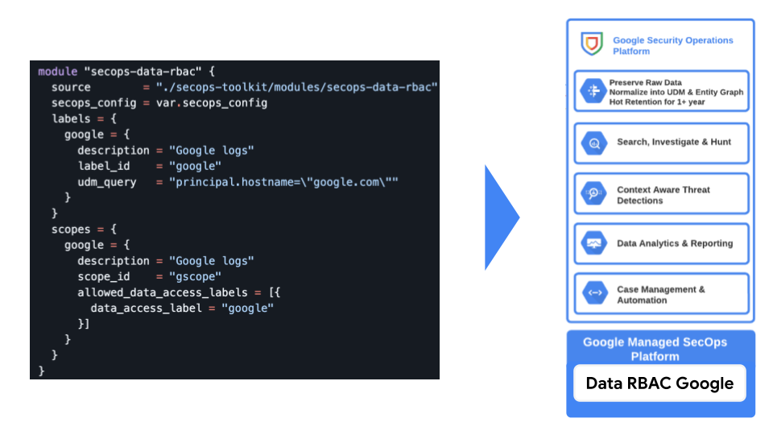
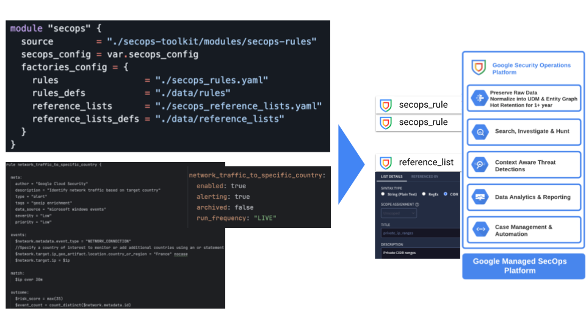

# Terraform modules suite for Google SecOps

This folder contains a suite of Terraform modules for Google SecOps automation. They are designed to be composed together, and are designed to be forked and modified where use of third party code and sources is not allowed.

Modules try to stay close to the low level provider resources they encapsulate, and they all share a similar interface that combines management of one resource or set or resources, and the corresponding IAM bindings.

These modules are not necessarily backward compatible. Changes breaking compatibility in modules are marked by major releases (but not all major releases contain breaking changes). Please be mindful when upgrading Fabric modules in existing Terraform setups, and always try to use versioned references in module sources so you can easily revert back to a previous version. Since the introduction of the `moved` block in Terraform we try to use it whenever possible to make updates non-breaking, but that does not cover all changes we might need to make.

These modules are used in the examples included in this repository. If you are using any of those examples in your own Terraform configuration, make sure that you are using the same version for all the modules, and switch module sources to GitHub format using references. 
The recommended approach to working with SecOps modules is the following:

- Fork the repository and own the fork. This will allow you to:
    - Evolve the existing modules.
    - Create your own modules.
    - Sync from the upstream repository to get all the updates.

### SecOps Data RBAC

 
 
This [module](./secops-data-rbac) allows configuration of Data RBAC in Google SecOps.

 

### SecOps Rules and Reference lists

 
This [module](./secops-rules) allows creation and management of custom rules as well as reference lists in Google SecOps.

 