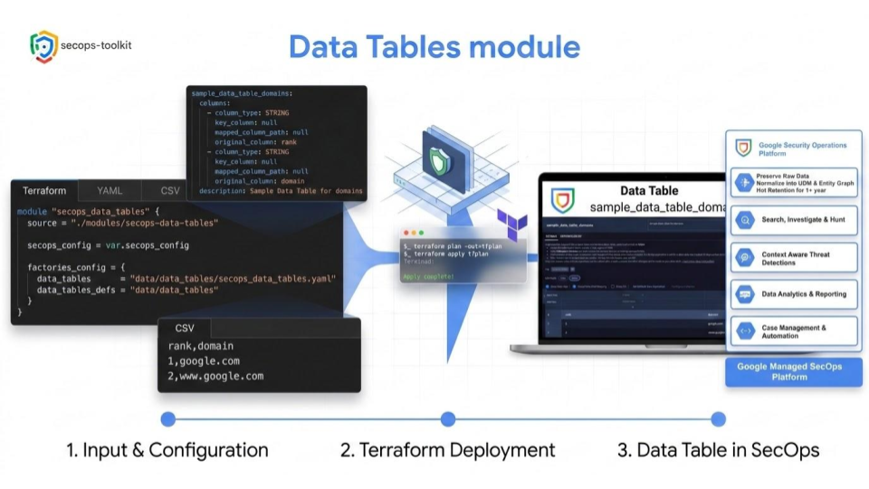

# SecOps Data Tables Module

This module manages Google SecOps (Chronicle) Data Tables and their content.

- **Note:** The `data_tables_config` variable has been completely removed. It is now **mandatory** to use the YAML factory approach for provisioning data tables via `factories_config`.
- Data table definitions and content are managed as files in the data folder as per the `factories_config` variable and sample code.
- Data table deployments exclusively leverage YAML configuration files specified in the `factories_config` variable.
- Data table rows use an MD5 hash of their values as the resource key to safely handle row reordering.

<p align="center">
  
</p>

<!-- BEGIN TOC -->
- [Examples](#examples)
  - [SecOps Data Tables Factory](#secops-data-tables-factory)
- [Variables](#variables)
<!-- END TOC -->

## Examples

### SecOps Data Tables Factory

The module includes a secops data tables factory (see [Resource Factories](https://github.com/GoogleCloudPlatform/cloud-foundation-fabric/tree/master/blueprints/factories)) for the configuration of data tables leveraging YAML configuration files. Each configuration file for data tables contains more than one data table with a structure that defines its schema and optionally its description. Data table content is provided via corresponding CSV files in the data folder.

```hcl
module "secops" {
  source        = "./secops-toolkit/modules/secops-data-tables"
  secops_config = var.secops_config
  factories_config = {
    data_tables_defs = "data_tables"
    data_tables      = "secops_data_tables.yaml"
  }
}
# tftest modules=1 resources=4 files=factory_data_table_content,factory_data_table_definition inventory=factory.yaml
```

```
rank,domain
1,google.com
2,www.google.com
# tftest-file id=factory_data_table_content path=data_tables/sample_data_table_domains.csv ,_
```

```yaml
sample_data_table_domains:
  columns:
    - column_type: "STRING"
      key_column: null
      mapped_column_path: null
      original_column: "rank"
    - column_type: "STRING"
      key_column: null
      mapped_column_path: null
      original_column: "domain"
  description: "Sample Data Table for domains"
# tftest-file id=factory_data_table_definition path=secops_data_tables.yaml
```
<!-- BEGIN TFDOC -->
## Variables

| name | description | type | required | default |
|---|---|:---:|:---:|:---:|
| [data_tables_config](variables.tf#L34) | SecOps Data Tables configuration. | <code title="map&#40;object&#40;&#123;&#10;  description &#61; string&#10;  columns &#61; list&#40;object&#40;&#123;&#10;    column_type        &#61; optional&#40;string, &#34;STRING&#34;&#41;&#10;    key_column         &#61; optional&#40;bool, false&#41;&#10;    mapped_column_path &#61; optional&#40;string&#41;&#10;    original_column    &#61; string&#10;  &#125;&#41;&#41;&#10;  row_time_to_live &#61; optional&#40;string&#41;&#10;&#125;&#41;&#41;">map&#40;object&#40;&#123;&#8230;&#125;&#41;&#41;</code> |  | <code>&#123;&#125;</code> |
| [factories_config](variables.tf#L15) | Paths to YAML config expected in 'data_tables'. Path to folder containing data tables content (csv files) for the corresponding _defs keys. | <code title="object&#40;&#123;&#10;  data_tables      &#61; optional&#40;string&#41;&#10;  data_tables_defs &#61; optional&#40;string, &#34;data_tables&#34;&#41;&#10;&#125;&#41;">object&#40;&#123;&#8230;&#125;&#41;</code> |  | <code>&#123;&#125;</code> |
| [secops_config](variables.tf#L25) | SecOps configuration. | <code title="object&#40;&#123;&#10;  customer_id &#61; string&#10;  project     &#61; string&#10;  region      &#61; string&#10;&#125;&#41;">object&#40;&#123;&#8230;&#125;&#41;</code> | ✓ |  |
<!-- END TFDOC -->
