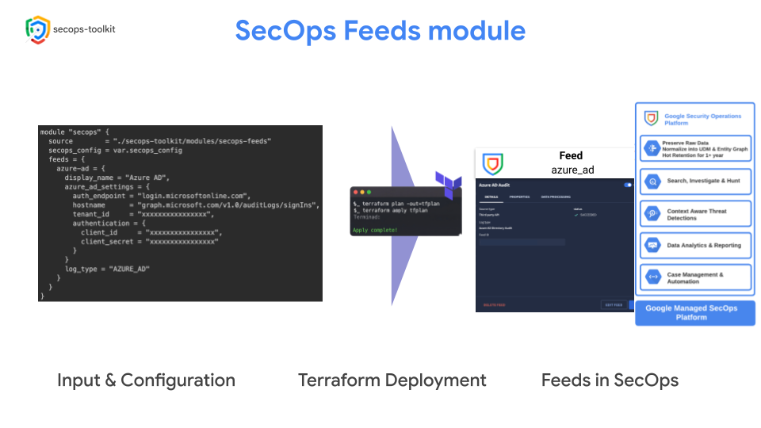

# SecOps Feeds Terraform Module

This module creates and manages SecOps Feeds using the `google_chronicle_feed` resource from the Google Provider (beta).

It supports a wide variety of feed source types, and the `feed_source_type` is automatically determined based on the settings provided.

<p align="center">
  
</p>

<!-- BEGIN TOC -->
- [Usage](#usage)
- [Tests](#tests)
- [Variables](#variables)
- [Outputs](#outputs)
<!-- END TOC -->

## Usage

To use this module, you need to define a map of feeds in the `feeds` variable. Each feed is an object with common properties and a specific settings block for the desired source type.

```terraform
module "chronicle_feeds" {
  source = "./modules/secops-feeds"

  feeds = {
    # Sample Workspace feed
    ws-activity = {
      display_name = "Workspace Activity"
      log_type     = "WORKSPACE_ACTIVITY"
      workspace_activity_settings = {
        workspace_customer_id = "C0000000"
        applications          = ["admin", "calendar", "chat", "drive", "gcp", "gplus", "groups", "groups_enterprise", "jamboard", "login", "meet", "mobile", "rules", "saml", "token", "user_accounts", "context_aware_access", "chrome", "data_studio", "keep"]
        authentication = {
          token_endpoint = "https://oauth2.googleapis.com/token",
          claims = {
            audience = "https://oauth2.googleapis.com/token",
            issuer   = "service-account-email@project-id.iam.gserviceaccount.com",
            subject  = "delegated-user@domain.com"
          }
          rs_credentials = {
            private_key = "private-key"
          }
        }
      }
    }
    # Sample Azure AD feed with client_secret from Secret Manager
    azure-ad = {
      display_name = "Azure AD",
      secret_manager_config = {
        region      = "europe-west8",
        secret_name = "azure-ad-credentials"
      }
      azure_ad_settings = {
        auth_endpoint = "login.microsoftonline.com",
        hostname      = "graph.microsoft.com/v1.0/auditLogs/signIns",
        tenant_id     = "xxxxxxxxxxxxxxxx",
        authentication = {
          client_id     = "xxxxxxxxxxxxxxxx"
        }
      }
      log_type = "AZURE_AD"
    }
    # Sample Azure AD feed with inline client_secret
    azure-ad-2 = {
      display_name = "Azure AD 2",
      azure_ad_settings = {
        auth_endpoint = "login.microsoftonline.com",
        hostname      = "graph.microsoft.com/v1.0/auditLogs/signIns",
        tenant_id     = "xxxxxxxxxxxxxxxx",
        authentication = {
          client_id     = "xxxxxxxxxxxxxxxx",
          client_secret = "xxxxxxxxxxxxxxxx"
        }
      }
      log_type = "AZURE_AD"
    }
  }
}
```

## Tests

```hcl
module "secops" {
  source        = "./secops-toolkit/modules/secops-feeds"
  secops_config = var.secops_config
  feeds = {
    azure-ad = {
      display_name = "Azure AD",
      azure_ad_settings = {
        auth_endpoint = "login.microsoftonline.com",
        hostname      = "graph.microsoft.com/v1.0/auditLogs/signIns",
        tenant_id     = "xxxxxxxxxxxxxxxx",
        authentication = {
          client_id     = "xxxxxxxxxxxxxxxx",
          client_secret = "xxxxxxxxxxxxxxxx"
        }
      }
      log_type = "AZURE_AD"
    }
  }
}
# tftest modules=1 resources=1 inventory=basic.yaml
```
<!-- BEGIN TFDOC -->
## Variables

| name | description | type | required | default |
|---|---|:---:|:---:|:---:|
| [secops_config](variables.tf#L819) | SecOps configuration. | <code title="object&#40;&#123;&#10;  customer_id &#61; string&#10;  project     &#61; string&#10;  region      &#61; string&#10;&#125;&#41;">object&#40;&#123;&#8230;&#125;&#41;</code> | ✓ |  |
| [feeds](variables.tf#L17) | A map of Chronicle feeds to create. | <code title="map&#40;object&#40;&#123;&#10;  display_name    &#61; string&#10;  log_type        &#61; string&#10;  enabled         &#61; optional&#40;bool, true&#41;&#10;  asset_namespace &#61; optional&#40;string&#41;&#10;  labels          &#61; optional&#40;map&#40;string&#41;&#41;&#10;&#10;&#10;  secret_manager_config &#61; optional&#40;object&#40;&#123;&#10;    region      &#61; string&#10;    secret_name &#61; string&#10;    version     &#61; optional&#40;string&#41;&#10;  &#125;&#41;&#41;&#10;&#10;&#10;  amazon_s3_settings &#61; optional&#40;object&#40;&#123;&#10;    s3_uri                 &#61; string&#10;    source_deletion_option &#61; string&#10;    source_type            &#61; string&#10;    authentication &#61; optional&#40;object&#40;&#123;&#10;      region            &#61; string&#10;      access_key_id     &#61; optional&#40;string&#41;&#10;      secret_access_key &#61; optional&#40;string&#41;&#10;      client_id         &#61; optional&#40;string&#41;&#10;      client_secret     &#61; optional&#40;string&#41;&#10;      refresh_uri       &#61; optional&#40;string&#41;&#10;    &#125;&#41;&#41;&#10;  &#125;&#41;&#41;&#10;&#10;&#10;  amazon_s3_v2_settings &#61; optional&#40;object&#40;&#123;&#10;    s3_uri                 &#61; string&#10;    source_deletion_option &#61; optional&#40;string&#41;&#10;    max_lookback_days      &#61; optional&#40;number&#41;&#10;    authentication &#61; object&#40;&#123;&#10;      access_key_secret_auth &#61; optional&#40;object&#40;&#123;&#10;        access_key_id     &#61; string&#10;        secret_access_key &#61; string&#10;      &#125;&#41;&#41;&#10;      aws_iam_role_auth &#61; optional&#40;object&#40;&#123;&#10;        aws_iam_role_arn &#61; optional&#40;string&#41;&#10;        subject_id       &#61; optional&#40;string&#41;&#10;      &#125;&#41;&#41;&#10;    &#125;&#41;&#10;  &#125;&#41;&#41;&#10;&#10;&#10;  amazon_sqs_settings &#61; optional&#40;object&#40;&#123;&#10;    account_number         &#61; optional&#40;string&#41;&#10;    queue                  &#61; optional&#40;string&#41;&#10;    region                 &#61; optional&#40;string&#41;&#10;    source_deletion_option &#61; optional&#40;string&#41;&#10;    authentication &#61; optional&#40;object&#40;&#123;&#10;      additional_s3_access_key_secret_auth &#61; optional&#40;object&#40;&#123;&#10;        access_key_id     &#61; optional&#40;string&#41;&#10;        secret_access_key &#61; optional&#40;string&#41;&#10;      &#125;&#41;&#41;&#10;      sqs_access_key_secret_auth &#61; optional&#40;object&#40;&#123;&#10;        access_key_id     &#61; optional&#40;string&#41;&#10;        secret_access_key &#61; optional&#40;string&#41;&#10;      &#125;&#41;&#41;&#10;    &#125;&#41;&#41;&#10;  &#125;&#41;&#41;&#10;&#10;&#10;  amazon_sqs_v2_settings &#61; optional&#40;object&#40;&#123;&#10;    queue                  &#61; string&#10;    s3_uri                 &#61; string&#10;    source_deletion_option &#61; optional&#40;string&#41;&#10;    max_lookback_days      &#61; optional&#40;number&#41;&#10;    authentication &#61; object&#40;&#123;&#10;      aws_iam_role_auth &#61; object&#40;&#123;&#10;        aws_iam_role_arn &#61; optional&#40;string&#41;&#10;        subject_id       &#61; optional&#40;string&#41;&#10;      &#125;&#41;&#10;      sqs_v2_access_key_secret_auth &#61; object&#40;&#123;&#10;        access_key_id     &#61; optional&#40;string&#41;&#10;        secret_access_key &#61; optional&#40;string&#41;&#10;      &#125;&#41;&#10;    &#125;&#41;&#10;  &#125;&#41;&#41;&#10;&#10;&#10;  anomali_settings &#61; optional&#40;object&#40;&#123;&#10;    authentication &#61; optional&#40;object&#40;&#123;&#10;      user   &#61; optional&#40;string&#41;&#10;      secret &#61; optional&#40;string&#41;&#10;    &#125;&#41;&#41;&#10;  &#125;&#41;&#41;&#10;&#10;&#10;  aws_ec2_hosts_settings &#61; optional&#40;object&#40;&#123;&#10;    authentication &#61; optional&#40;object&#40;&#123;&#10;      user   &#61; optional&#40;string&#41;&#10;      secret &#61; optional&#40;string&#41;&#10;    &#125;&#41;&#41;&#10;  &#125;&#41;&#41;&#10;&#10;&#10;  aws_ec2_instances_settings &#61; optional&#40;object&#40;&#123;&#10;    authentication &#61; optional&#40;object&#40;&#123;&#10;      user   &#61; optional&#40;string&#41;&#10;      secret &#61; optional&#40;string&#41;&#10;    &#125;&#41;&#41;&#10;  &#125;&#41;&#41;&#10;&#10;&#10;  aws_ec2_vpcs_settings &#61; optional&#40;object&#40;&#123;&#10;    authentication &#61; optional&#40;object&#40;&#123;&#10;      user   &#61; optional&#40;string&#41;&#10;      secret &#61; optional&#40;string&#41;&#10;    &#125;&#41;&#41;&#10;  &#125;&#41;&#41;&#10;&#10;&#10;  aws_iam_settings &#61; optional&#40;object&#40;&#123;&#10;    api_type &#61; optional&#40;string&#41;&#10;    authentication &#61; optional&#40;object&#40;&#123;&#10;      user   &#61; optional&#40;string&#41;&#10;      secret &#61; optional&#40;string&#41;&#10;    &#125;&#41;&#41;&#10;  &#125;&#41;&#41;&#10;&#10;&#10;  azure_ad_audit_settings &#61; optional&#40;object&#40;&#123;&#10;    auth_endpoint &#61; optional&#40;string&#41;&#10;    hostname      &#61; optional&#40;string&#41;&#10;    tenant_id     &#61; optional&#40;string&#41;&#10;    authentication &#61; optional&#40;object&#40;&#123;&#10;      client_id     &#61; optional&#40;string&#41;&#10;      client_secret &#61; optional&#40;string&#41;&#10;    &#125;&#41;&#41;&#10;  &#125;&#41;&#41;&#10;&#10;&#10;  azure_ad_context_settings &#61; optional&#40;object&#40;&#123;&#10;    auth_endpoint    &#61; optional&#40;string&#41;&#10;    hostname         &#61; optional&#40;string&#41;&#10;    tenant_id        &#61; optional&#40;string&#41;&#10;    retrieve_devices &#61; optional&#40;bool&#41;&#10;    retrieve_groups  &#61; optional&#40;bool&#41;&#10;    authentication &#61; optional&#40;object&#40;&#123;&#10;      client_id     &#61; optional&#40;string&#41;&#10;      client_secret &#61; optional&#40;string&#41;&#10;    &#125;&#41;&#41;&#10;  &#125;&#41;&#41;&#10;&#10;&#10;  azure_ad_settings &#61; optional&#40;object&#40;&#123;&#10;    auth_endpoint &#61; optional&#40;string&#41;&#10;    hostname      &#61; optional&#40;string&#41;&#10;    tenant_id     &#61; optional&#40;string&#41;&#10;    authentication &#61; optional&#40;object&#40;&#123;&#10;      client_id     &#61; optional&#40;string&#41;&#10;      client_secret &#61; optional&#40;string&#41;&#10;    &#125;&#41;&#41;&#10;  &#125;&#41;&#41;&#10;&#10;&#10;  azure_blob_store_settings &#61; optional&#40;object&#40;&#123;&#10;    azure_uri              &#61; optional&#40;string&#41;&#10;    source_deletion_option &#61; optional&#40;string&#41;&#10;    source_type            &#61; optional&#40;string&#41;&#10;    authentication &#61; optional&#40;object&#40;&#123;&#10;      sas_token  &#61; optional&#40;string&#41;&#10;      shared_key &#61; optional&#40;string&#41;&#10;    &#125;&#41;&#41;&#10;  &#125;&#41;&#41;&#10;&#10;&#10;  azure_blob_store_v2_settings &#61; optional&#40;object&#40;&#123;&#10;    azure_uri              &#61; string&#10;    source_deletion_option &#61; optional&#40;string&#41;&#10;    max_lookback_days      &#61; optional&#40;number&#41;&#10;    authentication &#61; object&#40;&#123;&#10;      access_key &#61; string&#10;      sas_token  &#61; string&#10;      azure_v2_workload_identity_federation &#61; object&#40;&#123;&#10;        client_id  &#61; string&#10;        subject_id &#61; string&#10;        tenant_id  &#61; string&#10;      &#125;&#41;&#10;    &#125;&#41;&#10;  &#125;&#41;&#41;&#10;&#10;&#10;  azure_event_hub_settings &#61; optional&#40;object&#40;&#123;&#10;    consumer_group                  &#61; string&#10;    event_hub_connection_string     &#61; string&#10;    name                            &#61; string&#10;    azure_sas_token                 &#61; optional&#40;string&#41;&#10;    azure_storage_connection_string &#61; optional&#40;string&#41;&#10;    azure_storage_container         &#61; optional&#40;string&#41;&#10;  &#125;&#41;&#41;&#10;&#10;&#10;  azure_mdm_intune_settings &#61; optional&#40;object&#40;&#123;&#10;    auth_endpoint &#61; optional&#40;string&#41;&#10;    hostname      &#61; optional&#40;string&#41;&#10;    tenant_id     &#61; optional&#40;string&#41;&#10;    authentication &#61; optional&#40;object&#40;&#123;&#10;      client_id     &#61; optional&#40;string&#41;&#10;      client_secret &#61; optional&#40;string&#41;&#10;    &#125;&#41;&#41;&#10;  &#125;&#41;&#41;&#10;&#10;&#10;  cloud_passage_settings &#61; optional&#40;object&#40;&#123;&#10;    event_types &#61; optional&#40;list&#40;string&#41;&#41;&#10;    authentication &#61; optional&#40;object&#40;&#123;&#10;      user   &#61; optional&#40;string&#41;&#10;      secret &#61; optional&#40;string&#41;&#10;    &#125;&#41;&#41;&#10;  &#125;&#41;&#41;&#10;&#10;&#10;  cortex_xdr_settings &#61; optional&#40;object&#40;&#123;&#10;    endpoint &#61; optional&#40;string&#41;&#10;    hostname &#61; optional&#40;string&#41;&#10;    authentication &#61; optional&#40;object&#40;&#123;&#10;      header_key_values &#61; optional&#40;list&#40;object&#40;&#123;&#10;        key   &#61; optional&#40;string&#41;&#10;        value &#61; optional&#40;string&#41;&#10;      &#125;&#41;&#41;&#41;&#10;    &#125;&#41;&#41;&#10;  &#125;&#41;&#41;&#10;&#10;&#10;  crowdstrike_alerts_settings &#61; optional&#40;object&#40;&#123;&#10;    hostname       &#61; string&#10;    ingestion_type &#61; optional&#40;string&#41;&#10;    authentication &#61; object&#40;&#123;&#10;      client_id      &#61; optional&#40;string&#41;&#10;      client_secret  &#61; optional&#40;string&#41;&#10;      token_endpoint &#61; optional&#40;string&#41;&#10;    &#125;&#41;&#10;  &#125;&#41;&#41;&#10;&#10;&#10;  crowdstrike_detects_settings &#61; optional&#40;object&#40;&#123;&#10;    hostname       &#61; optional&#40;string&#41;&#10;    ingestion_type &#61; optional&#40;string&#41;&#10;    authentication &#61; optional&#40;object&#40;&#123;&#10;      client_id      &#61; optional&#40;string&#41;&#10;      client_secret  &#61; optional&#40;string&#41;&#10;      token_endpoint &#61; optional&#40;string&#41;&#10;    &#125;&#41;&#41;&#10;  &#125;&#41;&#41;&#10;&#10;&#10;  dummy_log_type_settings &#61; optional&#40;object&#40;&#123;&#10;    api_endpoint &#61; optional&#40;string&#41;&#10;    authentication &#61; optional&#40;object&#40;&#123;&#10;      header_key_values &#61; optional&#40;list&#40;object&#40;&#123;&#10;        key   &#61; optional&#40;string&#41;&#10;        value &#61; optional&#40;string&#41;&#10;      &#125;&#41;&#41;&#41;&#10;    &#125;&#41;&#41;&#10;  &#125;&#41;&#41;&#10;&#10;&#10;  duo_auth_settings &#61; optional&#40;object&#40;&#123;&#10;    hostname &#61; optional&#40;string&#41;&#10;    authentication &#61; optional&#40;object&#40;&#123;&#10;      user   &#61; optional&#40;string&#41;&#10;      secret &#61; optional&#40;string&#41;&#10;    &#125;&#41;&#41;&#10;  &#125;&#41;&#41;&#10;&#10;&#10;  duo_user_context_settings &#61; optional&#40;object&#40;&#123;&#10;    hostname &#61; optional&#40;string&#41;&#10;    authentication &#61; optional&#40;object&#40;&#123;&#10;      user   &#61; optional&#40;string&#41;&#10;      secret &#61; optional&#40;string&#41;&#10;    &#125;&#41;&#41;&#10;  &#125;&#41;&#41;&#10;&#10;&#10;  fox_it_stix_settings &#61; optional&#40;object&#40;&#123;&#10;    collection       &#61; optional&#40;string&#41;&#10;    poll_service_uri &#61; optional&#40;string&#41;&#10;    authentication &#61; optional&#40;object&#40;&#123;&#10;      user   &#61; optional&#40;string&#41;&#10;      secret &#61; optional&#40;string&#41;&#10;    &#125;&#41;&#41;&#10;    ssl &#61; optional&#40;object&#40;&#123;&#10;      encoded_private_key &#61; optional&#40;string&#41;&#10;      ssl_certificate     &#61; optional&#40;string&#41;&#10;    &#125;&#41;&#41;&#10;  &#125;&#41;&#41;&#10;&#10;&#10;  gcs_settings &#61; optional&#40;object&#40;&#123;&#10;    bucket_uri             &#61; optional&#40;string&#41;&#10;    source_deletion_option &#61; optional&#40;string&#41;&#10;    source_type            &#61; optional&#40;string&#41;&#10;  &#125;&#41;&#41;&#10;&#10;&#10;  gcs_v2_settings &#61; optional&#40;object&#40;&#123;&#10;    bucket_uri             &#61; string&#10;    source_deletion_option &#61; optional&#40;string&#41;&#10;    max_lookback_days      &#61; optional&#40;number&#41;&#10;  &#125;&#41;&#41;&#10;&#10;&#10;  google_cloud_identity_device_users_settings &#61; optional&#40;object&#40;&#123;&#10;    authentication &#61; optional&#40;object&#40;&#123;&#10;      token_endpoint &#61; optional&#40;string&#41;&#10;      claims &#61; optional&#40;object&#40;&#123;&#10;        audience &#61; optional&#40;string&#41;&#10;        issuer   &#61; optional&#40;string&#41;&#10;        subject  &#61; optional&#40;string&#41;&#10;      &#125;&#41;&#41;&#10;      rs_credentials &#61; optional&#40;object&#40;&#123;&#10;        private_key &#61; optional&#40;string&#41;&#10;      &#125;&#41;&#41;&#10;    &#125;&#41;&#41;&#10;  &#125;&#41;&#41;&#10;&#10;&#10;  google_cloud_identity_devices_settings &#61; optional&#40;object&#40;&#123;&#10;    api_version &#61; optional&#40;string&#41;&#10;    authentication &#61; optional&#40;object&#40;&#123;&#10;      token_endpoint &#61; optional&#40;string&#41;&#10;      claims &#61; optional&#40;object&#40;&#123;&#10;        audience &#61; optional&#40;string&#41;&#10;        issuer   &#61; optional&#40;string&#41;&#10;        subject  &#61; optional&#40;string&#41;&#10;      &#125;&#41;&#41;&#10;      rs_credentials &#61; optional&#40;object&#40;&#123;&#10;        private_key &#61; optional&#40;string&#41;&#10;      &#125;&#41;&#41;&#10;    &#125;&#41;&#41;&#10;  &#125;&#41;&#41;&#10;&#10;&#10;  google_cloud_storage_event_driven_settings &#61; optional&#40;object&#40;&#123;&#10;    bucket_uri             &#61; string&#10;    pubsub_subscription    &#61; string&#10;    max_lookback_days      &#61; optional&#40;number&#41;&#10;    source_deletion_option &#61; optional&#40;string&#41;&#10;  &#125;&#41;&#41;&#10;&#10;&#10;  http_settings &#61; optional&#40;object&#40;&#123;&#10;    uri                    &#61; optional&#40;string&#41;&#10;    source_deletion_option &#61; optional&#40;string&#41;&#10;    source_type            &#61; optional&#40;string&#41;&#10;  &#125;&#41;&#41;&#10;&#10;&#10;  https_push_amazon_kinesis_firehose_settings &#61; optional&#40;object&#40;&#123;&#10;    split_delimiter &#61; optional&#40;string&#41;&#10;  &#125;&#41;&#41;&#10;&#10;&#10;  https_push_google_cloud_pubsub_settings &#61; optional&#40;object&#40;&#123;&#10;    split_delimiter &#61; optional&#40;string&#41;&#10;  &#125;&#41;&#41;&#10;&#10;&#10;  https_push_webhook_settings &#61; optional&#40;object&#40;&#123;&#10;    split_delimiter &#61; optional&#40;string&#41;&#10;  &#125;&#41;&#41;&#10;&#10;&#10;  imperva_waf_settings &#61; optional&#40;object&#40;&#123;&#10;    authentication &#61; optional&#40;object&#40;&#123;&#10;      header_key_values &#61; optional&#40;list&#40;object&#40;&#123;&#10;        key   &#61; optional&#40;string&#41;&#10;        value &#61; optional&#40;string&#41;&#10;      &#125;&#41;&#41;&#41;&#10;    &#125;&#41;&#41;&#10;  &#125;&#41;&#41;&#10;&#10;&#10;  mandiant_ioc_settings &#61; optional&#40;object&#40;&#123;&#10;    start_time &#61; optional&#40;string&#41;&#10;    authentication &#61; optional&#40;object&#40;&#123;&#10;      header_key_values &#61; optional&#40;list&#40;object&#40;&#123;&#10;        key   &#61; optional&#40;string&#41;&#10;        value &#61; optional&#40;string&#41;&#10;      &#125;&#41;&#41;&#41;&#10;    &#125;&#41;&#41;&#10;  &#125;&#41;&#41;&#10;&#10;&#10;  microsoft_graph_alert_settings &#61; optional&#40;object&#40;&#123;&#10;    auth_endpoint &#61; optional&#40;string&#41;&#10;    hostname      &#61; optional&#40;string&#41;&#10;    tenant_id     &#61; optional&#40;string&#41;&#10;    authentication &#61; optional&#40;object&#40;&#123;&#10;      client_id     &#61; optional&#40;string&#41;&#10;      client_secret &#61; optional&#40;string&#41;&#10;    &#125;&#41;&#41;&#10;  &#125;&#41;&#41;&#10;&#10;&#10;  microsoft_security_center_alert_settings &#61; optional&#40;object&#40;&#123;&#10;    auth_endpoint   &#61; optional&#40;string&#41;&#10;    hostname        &#61; optional&#40;string&#41;&#10;    subscription_id &#61; optional&#40;string&#41;&#10;    tenant_id       &#61; optional&#40;string&#41;&#10;    authentication &#61; optional&#40;object&#40;&#123;&#10;      client_id     &#61; optional&#40;string&#41;&#10;      client_secret &#61; optional&#40;string&#41;&#10;    &#125;&#41;&#41;&#10;  &#125;&#41;&#41;&#10;&#10;&#10;  mimecast_mail_settings &#61; optional&#40;object&#40;&#123;&#10;    hostname &#61; optional&#40;string&#41;&#10;    authentication &#61; optional&#40;object&#40;&#123;&#10;      header_key_values &#61; optional&#40;list&#40;object&#40;&#123;&#10;        key   &#61; optional&#40;string&#41;&#10;        value &#61; optional&#40;string&#41;&#10;      &#125;&#41;&#41;&#41;&#10;    &#125;&#41;&#41;&#10;  &#125;&#41;&#41;&#10;&#10;&#10;  mimecast_mail_v2_settings &#61; optional&#40;object&#40;&#123;&#10;    auth_credentials &#61; optional&#40;object&#40;&#123;&#10;      client_id     &#61; optional&#40;string&#41;&#10;      client_secret &#61; optional&#40;string&#41;&#10;    &#125;&#41;&#41;&#10;  &#125;&#41;&#41;&#10;&#10;&#10;  netskope_alert_settings &#61; optional&#40;object&#40;&#123;&#10;    content_type &#61; optional&#40;string&#41;&#10;    feedname     &#61; optional&#40;string&#41;&#10;    hostname     &#61; optional&#40;string&#41;&#10;    authentication &#61; optional&#40;object&#40;&#123;&#10;      header_key_values &#61; optional&#40;list&#40;object&#40;&#123;&#10;        key   &#61; optional&#40;string&#41;&#10;        value &#61; optional&#40;string&#41;&#10;      &#125;&#41;&#41;&#41;&#10;    &#125;&#41;&#41;&#10;  &#125;&#41;&#41;&#10;&#10;&#10;  netskope_alert_v2_settings &#61; optional&#40;object&#40;&#123;&#10;    content_category &#61; optional&#40;string&#41;&#10;    content_types    &#61; optional&#40;list&#40;string&#41;&#41;&#10;    hostname         &#61; optional&#40;string&#41;&#10;    authentication &#61; optional&#40;object&#40;&#123;&#10;      header_key_values &#61; optional&#40;list&#40;object&#40;&#123;&#10;        key   &#61; optional&#40;string&#41;&#10;        value &#61; optional&#40;string&#41;&#10;      &#125;&#41;&#41;&#41;&#10;    &#125;&#41;&#41;&#10;  &#125;&#41;&#41;&#10;&#10;&#10;  office365_settings &#61; optional&#40;object&#40;&#123;&#10;    auth_endpoint &#61; optional&#40;string&#41;&#10;    hostname      &#61; optional&#40;string&#41;&#10;    tenant_id     &#61; optional&#40;string&#41;&#10;    content_type  &#61; optional&#40;string&#41;&#10;    authentication &#61; optional&#40;object&#40;&#123;&#10;      client_id     &#61; optional&#40;string&#41;&#10;      client_secret &#61; optional&#40;string&#41;&#10;    &#125;&#41;&#41;&#10;  &#125;&#41;&#41;&#10;&#10;&#10;  okta_settings &#61; optional&#40;object&#40;&#123;&#10;    hostname &#61; optional&#40;string&#41;&#10;    authentication &#61; optional&#40;object&#40;&#123;&#10;      header_key_values &#61; optional&#40;list&#40;object&#40;&#123;&#10;        key   &#61; optional&#40;string&#41;&#10;        value &#61; optional&#40;string&#41;&#10;      &#125;&#41;&#41;&#41;&#10;    &#125;&#41;&#41;&#10;  &#125;&#41;&#41;&#10;&#10;&#10;  okta_user_context_settings &#61; optional&#40;object&#40;&#123;&#10;    hostname                   &#61; optional&#40;string&#41;&#10;    manager_id_reference_field &#61; optional&#40;string&#41;&#10;    authentication &#61; optional&#40;object&#40;&#123;&#10;      header_key_values &#61; optional&#40;list&#40;object&#40;&#123;&#10;        key   &#61; optional&#40;string&#41;&#10;        value &#61; optional&#40;string&#41;&#10;      &#125;&#41;&#41;&#41;&#10;    &#125;&#41;&#41;&#10;  &#125;&#41;&#41;&#10;&#10;&#10;  pan_ioc_settings &#61; optional&#40;object&#40;&#123;&#10;    feed    &#61; optional&#40;string&#41;&#10;    feed_id &#61; optional&#40;string&#41;&#10;    authentication &#61; optional&#40;object&#40;&#123;&#10;      header_key_values &#61; optional&#40;list&#40;object&#40;&#123;&#10;        key   &#61; optional&#40;string&#41;&#10;        value &#61; optional&#40;string&#41;&#10;      &#125;&#41;&#41;&#41;&#10;    &#125;&#41;&#41;&#10;  &#125;&#41;&#41;&#10;&#10;&#10;  pan_prisma_cloud_settings &#61; optional&#40;object&#40;&#123;&#10;    hostname &#61; optional&#40;string&#41;&#10;    authentication &#61; optional&#40;object&#40;&#123;&#10;      user     &#61; optional&#40;string&#41;&#10;      password &#61; optional&#40;string&#41;&#10;    &#125;&#41;&#41;&#10;  &#125;&#41;&#41;&#10;&#10;&#10;  proofpoint_mail_settings &#61; optional&#40;object&#40;&#123;&#10;    authentication &#61; optional&#40;object&#40;&#123;&#10;      user   &#61; optional&#40;string&#41;&#10;      secret &#61; optional&#40;string&#41;&#10;    &#125;&#41;&#41;&#10;  &#125;&#41;&#41;&#10;&#10;&#10;  proofpoint_on_demand_settings &#61; optional&#40;object&#40;&#123;&#10;    cluster_id &#61; optional&#40;string&#41;&#10;    authentication &#61; optional&#40;object&#40;&#123;&#10;      header_key_values &#61; optional&#40;list&#40;object&#40;&#123;&#10;        key   &#61; optional&#40;string&#41;&#10;        value &#61; optional&#40;string&#41;&#10;      &#125;&#41;&#41;&#41;&#10;    &#125;&#41;&#41;&#10;  &#125;&#41;&#41;&#10;&#10;&#10;  pubsub_settings &#61; optional&#40;object&#40;&#123;&#10;    google_service_account_email &#61; optional&#40;string&#41;&#10;  &#125;&#41;&#41;&#10;&#10;&#10;  qualys_scan_settings &#61; optional&#40;object&#40;&#123;&#10;    api_type &#61; optional&#40;string&#41;&#10;    hostname &#61; optional&#40;string&#41;&#10;    authentication &#61; optional&#40;object&#40;&#123;&#10;      user   &#61; optional&#40;string&#41;&#10;      secret &#61; optional&#40;string&#41;&#10;    &#125;&#41;&#41;&#10;  &#125;&#41;&#41;&#10;&#10;&#10;  qualys_vm_settings &#61; optional&#40;object&#40;&#123;&#10;    hostname &#61; optional&#40;string&#41;&#10;    authentication &#61; optional&#40;object&#40;&#123;&#10;      user   &#61; optional&#40;string&#41;&#10;      secret &#61; optional&#40;string&#41;&#10;    &#125;&#41;&#41;&#10;  &#125;&#41;&#41;&#10;&#10;&#10;  rapid7_insight_settings &#61; optional&#40;object&#40;&#123;&#10;    endpoint &#61; optional&#40;string&#41;&#10;    hostname &#61; optional&#40;string&#41;&#10;    authentication &#61; optional&#40;object&#40;&#123;&#10;      header_key_values &#61; optional&#40;list&#40;object&#40;&#123;&#10;        key   &#61; optional&#40;string&#41;&#10;        value &#61; optional&#40;string&#41;&#10;      &#125;&#41;&#41;&#41;&#10;    &#125;&#41;&#41;&#10;  &#125;&#41;&#41;&#10;&#10;&#10;  recorded_future_ioc_settings &#61; optional&#40;object&#40;&#123;&#10;    authentication &#61; optional&#40;object&#40;&#123;&#10;      header_key_values &#61; optional&#40;list&#40;object&#40;&#123;&#10;        key   &#61; optional&#40;string&#41;&#10;        value &#61; optional&#40;string&#41;&#10;      &#125;&#41;&#41;&#41;&#10;    &#125;&#41;&#41;&#10;  &#125;&#41;&#41;&#10;&#10;&#10;  rh_isac_ioc_settings &#61; optional&#40;object&#40;&#123;&#10;    authentication &#61; optional&#40;object&#40;&#123;&#10;      client_id      &#61; optional&#40;string&#41;&#10;      client_secret  &#61; optional&#40;string&#41;&#10;      token_endpoint &#61; optional&#40;string&#41;&#10;    &#125;&#41;&#41;&#10;  &#125;&#41;&#41;&#10;&#10;&#10;  salesforce_settings &#61; optional&#40;object&#40;&#123;&#10;    hostname &#61; optional&#40;string&#41;&#10;    oauth_jwt_credentials &#61; optional&#40;object&#40;&#123;&#10;      token_endpoint &#61; optional&#40;string&#41;&#10;      claims &#61; optional&#40;object&#40;&#123;&#10;        audience &#61; optional&#40;string&#41;&#10;        issuer   &#61; optional&#40;string&#41;&#10;        subject  &#61; optional&#40;string&#41;&#10;      &#125;&#41;&#41;&#10;      rs_credentials &#61; optional&#40;object&#40;&#123;&#10;        private_key &#61; optional&#40;string&#41;&#10;      &#125;&#41;&#41;&#10;    &#125;&#41;&#41;&#10;    oauth_password_grant_auth &#61; optional&#40;object&#40;&#123;&#10;      token_endpoint &#61; optional&#40;string&#41;&#10;      client_id      &#61; optional&#40;string&#41;&#10;      client_secret  &#61; optional&#40;string&#41;&#10;      user           &#61; optional&#40;string&#41;&#10;      password       &#61; optional&#40;string&#41;&#10;    &#125;&#41;&#41;&#10;  &#125;&#41;&#41;&#10;&#10;&#10;  sentinelone_alert_settings &#61; optional&#40;object&#40;&#123;&#10;    hostname                &#61; optional&#40;string&#41;&#10;    initial_start_time      &#61; optional&#40;string&#41;&#10;    is_alert_api_subscribed &#61; optional&#40;bool&#41;&#10;    authentication &#61; optional&#40;object&#40;&#123;&#10;      header_key_values &#61; optional&#40;list&#40;object&#40;&#123;&#10;        key   &#61; optional&#40;string&#41;&#10;        value &#61; optional&#40;string&#41;&#10;      &#125;&#41;&#41;&#41;&#10;    &#125;&#41;&#41;&#10;  &#125;&#41;&#41;&#10;&#10;&#10;  service_now_cmdb_settings &#61; optional&#40;object&#40;&#123;&#10;    feedname &#61; optional&#40;string&#41;&#10;    hostname &#61; optional&#40;string&#41;&#10;    authentication &#61; optional&#40;object&#40;&#123;&#10;      user   &#61; optional&#40;string&#41;&#10;      secret &#61; optional&#40;string&#41;&#10;    &#125;&#41;&#41;&#10;  &#125;&#41;&#41;&#10;&#10;&#10;  sftp_settings &#61; optional&#40;object&#40;&#123;&#10;    uri                    &#61; optional&#40;string&#41;&#10;    source_deletion_option &#61; optional&#40;string&#41;&#10;    source_type            &#61; optional&#40;string&#41;&#10;    authentication &#61; optional&#40;object&#40;&#123;&#10;      username               &#61; optional&#40;string&#41;&#10;      password               &#61; optional&#40;string&#41;&#10;      private_key            &#61; optional&#40;string&#41;&#10;      private_key_passphrase &#61; optional&#40;string&#41;&#10;    &#125;&#41;&#41;&#10;  &#125;&#41;&#41;&#10;&#10;&#10;  symantec_event_export_settings &#61; optional&#40;object&#40;&#123;&#10;    authentication &#61; optional&#40;object&#40;&#123;&#10;      token_endpoint &#61; optional&#40;string&#41;&#10;      client_id      &#61; optional&#40;string&#41;&#10;      client_secret  &#61; optional&#40;string&#41;&#10;      refresh_token  &#61; optional&#40;string&#41;&#10;    &#125;&#41;&#41;&#10;  &#125;&#41;&#41;&#10;&#10;&#10;  thinkst_canary_settings &#61; optional&#40;object&#40;&#123;&#10;    hostname &#61; optional&#40;string&#41;&#10;    authentication &#61; optional&#40;object&#40;&#123;&#10;      header_key_values &#61; optional&#40;list&#40;object&#40;&#123;&#10;        key   &#61; optional&#40;string&#41;&#10;        value &#61; optional&#40;string&#41;&#10;      &#125;&#41;&#41;&#41;&#10;    &#125;&#41;&#41;&#10;  &#125;&#41;&#41;&#10;&#10;&#10;  threat_connect_ioc_settings &#61; optional&#40;object&#40;&#123;&#10;    hostname &#61; optional&#40;string&#41;&#10;    owners   &#61; optional&#40;list&#40;string&#41;&#41;&#10;    authentication &#61; optional&#40;object&#40;&#123;&#10;      user   &#61; optional&#40;string&#41;&#10;      secret &#61; optional&#40;string&#41;&#10;    &#125;&#41;&#41;&#10;  &#125;&#41;&#41;&#10;&#10;&#10;  threat_connect_ioc_v3_settings &#61; optional&#40;object&#40;&#123;&#10;    hostname  &#61; optional&#40;string&#41;&#10;    owners    &#61; optional&#40;list&#40;string&#41;&#41;&#10;    fields    &#61; optional&#40;list&#40;string&#41;&#41;&#10;    schedule  &#61; optional&#40;string&#41;&#10;    tql_query &#61; optional&#40;string&#41;&#10;    authentication &#61; optional&#40;object&#40;&#123;&#10;      user   &#61; optional&#40;string&#41;&#10;      secret &#61; optional&#40;string&#41;&#10;    &#125;&#41;&#41;&#10;  &#125;&#41;&#41;&#10;&#10;&#10;  trellix_hx_alerts_settings &#61; optional&#40;object&#40;&#123;&#10;    endpoint &#61; optional&#40;string&#41;&#10;    authentication &#61; optional&#40;object&#40;&#123;&#10;      msso &#61; optional&#40;object&#40;&#123;&#10;        api_endpoint &#61; optional&#40;string&#41;&#10;        username     &#61; optional&#40;string&#41;&#10;        password     &#61; optional&#40;string&#41;&#10;      &#125;&#41;&#41;&#10;      trellix_iam &#61; optional&#40;object&#40;&#123;&#10;        client_id     &#61; optional&#40;string&#41;&#10;        client_secret &#61; optional&#40;string&#41;&#10;        scope         &#61; optional&#40;string&#41;&#10;      &#125;&#41;&#41;&#10;    &#125;&#41;&#41;&#10;  &#125;&#41;&#41;&#10;&#10;&#10;  trellix_hx_bulk_acqs_settings &#61; optional&#40;object&#40;&#123;&#10;    endpoint &#61; string&#10;    authentication &#61; optional&#40;object&#40;&#123;&#10;      msso &#61; optional&#40;object&#40;&#123;&#10;        api_endpoint &#61; string&#10;        username     &#61; string&#10;        password     &#61; string&#10;      &#125;&#41;&#41;&#10;      trellix_iam &#61; optional&#40;object&#40;&#123;&#10;        client_id     &#61; string&#10;        client_secret &#61; string&#10;        scope         &#61; string&#10;      &#125;&#41;&#41;&#10;    &#125;&#41;&#41;&#10;  &#125;&#41;&#41;&#10;&#10;&#10;  trellix_hx_hosts_settings &#61; optional&#40;object&#40;&#123;&#10;    endpoint &#61; string&#10;    authentication &#61; optional&#40;object&#40;&#123;&#10;      msso &#61; optional&#40;object&#40;&#123;&#10;        api_endpoint &#61; string&#10;        username     &#61; string&#10;        password     &#61; string&#10;      &#125;&#41;&#41;&#10;      trellix_iam &#61; optional&#40;object&#40;&#123;&#10;        client_id     &#61; string&#10;        client_secret &#61; string&#10;        scope         &#61; string&#10;      &#125;&#41;&#41;&#10;    &#125;&#41;&#41;&#10;  &#125;&#41;&#41;&#10;&#10;&#10;  webhook_settings &#61; optional&#40;object&#40;&#123;&#10;  &#125;&#41;&#41;&#10;&#10;&#10;  workday_settings &#61; optional&#40;object&#40;&#123;&#10;    hostname  &#61; optional&#40;string&#41;&#10;    tenant_id &#61; optional&#40;string&#41;&#10;    authentication &#61; optional&#40;object&#40;&#123;&#10;      user           &#61; optional&#40;string&#41;&#10;      secret         &#61; optional&#40;string&#41;&#10;      token_endpoint &#61; optional&#40;string&#41;&#10;      client_id      &#61; optional&#40;string&#41;&#10;      client_secret  &#61; optional&#40;string&#41;&#10;      refresh_token  &#61; optional&#40;string&#41;&#10;    &#125;&#41;&#41;&#10;  &#125;&#41;&#41;&#10;&#10;&#10;  workspace_activity_settings &#61; optional&#40;object&#40;&#123;&#10;    workspace_customer_id &#61; optional&#40;string&#41;&#10;    applications          &#61; optional&#40;list&#40;string&#41;&#41;&#10;    authentication &#61; optional&#40;object&#40;&#123;&#10;      token_endpoint &#61; optional&#40;string&#41;&#10;      claims &#61; optional&#40;object&#40;&#123;&#10;        audience &#61; optional&#40;string&#41;&#10;        issuer   &#61; optional&#40;string&#41;&#10;        subject  &#61; optional&#40;string&#41;&#10;      &#125;&#41;&#41;&#10;      rs_credentials &#61; optional&#40;object&#40;&#123;&#10;        private_key &#61; optional&#40;string&#41;&#10;      &#125;&#41;&#41;&#10;    &#125;&#41;&#41;&#10;  &#125;&#41;&#41;&#10;&#10;&#10;  workspace_alerts_settings &#61; optional&#40;object&#40;&#123;&#10;    workspace_customer_id &#61; optional&#40;string&#41;&#10;    authentication &#61; optional&#40;object&#40;&#123;&#10;      token_endpoint &#61; optional&#40;string&#41;&#10;      claims &#61; optional&#40;object&#40;&#123;&#10;        audience &#61; optional&#40;string&#41;&#10;        issuer   &#61; optional&#40;string&#41;&#10;        subject  &#61; optional&#40;string&#41;&#10;      &#125;&#41;&#41;&#10;      rs_credentials &#61; optional&#40;object&#40;&#123;&#10;        private_key &#61; optional&#40;string&#41;&#10;      &#125;&#41;&#41;&#10;    &#125;&#41;&#41;&#10;  &#125;&#41;&#41;&#10;&#10;&#10;  workspace_chrome_os_settings &#61; optional&#40;object&#40;&#123;&#10;    workspace_customer_id &#61; optional&#40;string&#41;&#10;    authentication &#61; optional&#40;object&#40;&#123;&#10;      token_endpoint &#61; optional&#40;string&#41;&#10;      claims &#61; optional&#40;object&#40;&#123;&#10;        audience &#61; optional&#40;string&#41;&#10;        issuer   &#61; optional&#40;string&#41;&#10;        subject  &#61; optional&#40;string&#41;&#10;      &#125;&#41;&#41;&#10;      rs_credentials &#61; optional&#40;object&#40;&#123;&#10;        private_key &#61; optional&#40;string&#41;&#10;      &#125;&#41;&#41;&#10;    &#125;&#41;&#41;&#10;  &#125;&#41;&#41;&#10;&#10;&#10;  workspace_groups_settings &#61; optional&#40;object&#40;&#123;&#10;    workspace_customer_id &#61; optional&#40;string&#41;&#10;    authentication &#61; optional&#40;object&#40;&#123;&#10;      token_endpoint &#61; optional&#40;string&#41;&#10;      claims &#61; optional&#40;object&#40;&#123;&#10;        audience &#61; optional&#40;string&#41;&#10;        issuer   &#61; optional&#40;string&#41;&#10;        subject  &#61; optional&#40;string&#41;&#10;      &#125;&#41;&#41;&#10;      rs_credentials &#61; optional&#40;object&#40;&#123;&#10;        private_key &#61; optional&#40;string&#41;&#10;      &#125;&#41;&#41;&#10;    &#125;&#41;&#41;&#10;  &#125;&#41;&#41;&#10;&#10;&#10;  workspace_mobile_settings &#61; optional&#40;object&#40;&#123;&#10;    workspace_customer_id &#61; optional&#40;string&#41;&#10;    authentication &#61; optional&#40;object&#40;&#123;&#10;      token_endpoint &#61; optional&#40;string&#41;&#10;      claims &#61; optional&#40;object&#40;&#123;&#10;        audience &#61; optional&#40;string&#41;&#10;        issuer   &#61; optional&#40;string&#41;&#10;        subject  &#61; optional&#40;string&#41;&#10;      &#125;&#41;&#41;&#10;      rs_credentials &#61; optional&#40;object&#40;&#123;&#10;        private_key &#61; optional&#40;string&#41;&#10;      &#125;&#41;&#41;&#10;    &#125;&#41;&#41;&#10;  &#125;&#41;&#41;&#10;&#10;&#10;  workspace_privileges_settings &#61; optional&#40;object&#40;&#123;&#10;    workspace_customer_id &#61; optional&#40;string&#41;&#10;    authentication &#61; optional&#40;object&#40;&#123;&#10;      token_endpoint &#61; optional&#40;string&#41;&#10;      claims &#61; optional&#40;object&#40;&#123;&#10;        audience &#61; optional&#40;string&#41;&#10;        issuer   &#61; optional&#40;string&#41;&#10;        subject  &#61; optional&#40;string&#41;&#10;      &#125;&#41;&#41;&#10;      rs_credentials &#61; optional&#40;object&#40;&#123;&#10;        private_key &#61; optional&#40;string&#41;&#10;      &#125;&#41;&#41;&#10;    &#125;&#41;&#41;&#10;  &#125;&#41;&#41;&#10;&#10;&#10;  workspace_users_settings &#61; optional&#40;object&#40;&#123;&#10;    workspace_customer_id &#61; optional&#40;string&#41;&#10;    projection_type       &#61; optional&#40;string&#41;&#10;    authentication &#61; optional&#40;object&#40;&#123;&#10;      token_endpoint &#61; optional&#40;string&#41;&#10;      claims &#61; optional&#40;object&#40;&#123;&#10;        audience &#61; optional&#40;string&#41;&#10;        issuer   &#61; optional&#40;string&#41;&#10;        subject  &#61; optional&#40;string&#41;&#10;      &#125;&#41;&#41;&#10;      rs_credentials &#61; optional&#40;object&#40;&#123;&#10;        private_key &#61; optional&#40;string&#41;&#10;      &#125;&#41;&#41;&#10;    &#125;&#41;&#41;&#10;  &#125;&#41;&#41;&#10;&#125;&#41;&#41;">map&#40;object&#40;&#123;&#8230;&#125;&#41;&#41;</code> |  | <code>&#123;&#125;</code> |

## Outputs

| name | description | sensitive |
|---|---|:---:|
| [feeds_id](outputs.tf#L17) |  |  |
<!-- END TFDOC -->
