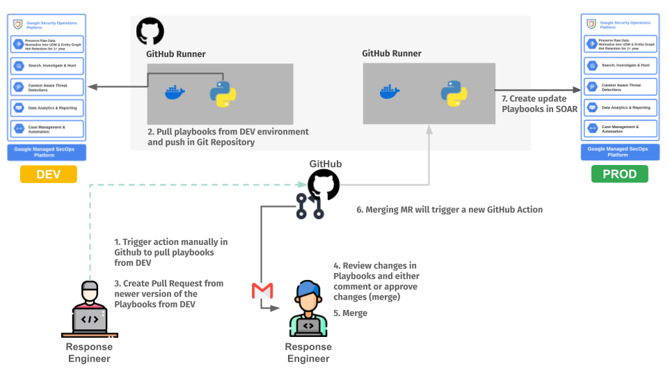

# SecOps Pipelines

This repository provides a collection of sample repositories for automating Google Cloud SecOps configuration through CICD pipelines.

## Dashboards As Code

 
This [sample repository](./dashboards-as-code/) provides a framework for managing SecOps Native Dashboards as Code.

 

## Detection As Code

 
This [sample repository](./detection-as-code/) contains ready to use code for automated deployment of detection rules and reference lists in Google SecOps via CICD (we currently have sample pipeline for GitLab and GitHub).

 

## Parsers As Code

 
This [sample repository](./parsers-as-code/) provides a framework for managing SecOps parsers as code.

 

## Response As Code

 
This [sample repository](./response-as-code/) provides a framework to manage and deploy SOAR playbooks using a "Response as Code" methodology.

 
