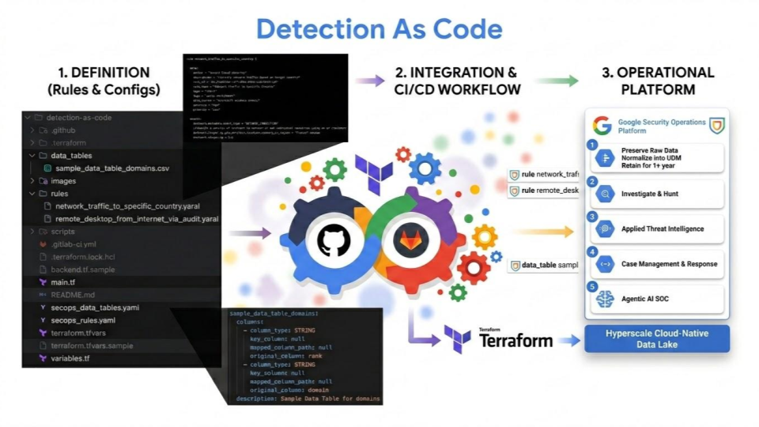
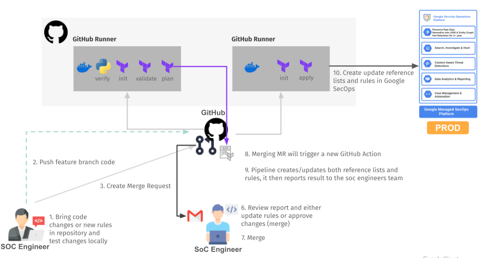

# Detection as Code in Terraform for Google SecOps



This blueprint provides a comprehensive "Detection as Code" framework to automate the management and deployment of Detection Rules, Data Tables and Reference Lists to Google SecOps. By leveraging Terraform and Python utilities, this repository enables a scalable and reliable workflow for security operations.

### Automation Scope

The pipeline automates the following key components:

- **Detection Rule Management**: Automated lifecycle management (CRUD) of YARA-L rules, including state tracking and versioning through Terraform.
- **Data Table Management**: Management of both the schema and content (CSV) of Google SecOps data tables, allowing for automated updates to enrichment data.
- **Reference List Management**: Unified management of reference lists using YAML configurations and associated text files for list entries.
- **Rule Verification**: A built-in syntax and logic verification tool (`main.py verify-rules`) that validates rules both locally and against the Google SecOps API.
- **Existing Rule Synchronization**: Ability to pull existing rules and deployments from Google SecOps (`main.py pull-rules`) to synchronize local configurations with the cloud environment.
- **CI/CD Integration**: Pre-configured pipelines for GitHub Actions and GitLab CI/CD, enabling automated testing and deployment on every commit.

For more information, please refer to these articles:
- [Detection as Code in Google SecOps with Terraform — Part 1](https://medium.com/p/646de8967278)
- [Detection as Code in Google SecOps with Terraform — Part 2](https://medium.com/p/907a5cffe3d8)

### File Structure

The repository is organized as follows:

- `rules/`: Directory containing YARA-L rule files (`.yaral`). Each rule is managed as a Terraform resource.
- `reference_lists/`: Contains text files (`.txt`) with entries for each reference list.
- `data_tables/`: Contains CSV files providing the content for Google SecOps data tables.
- `scripts/`: Python scripts for rule verification (`verify-rules`), data table updates (`update-data-tables`), and rule synchronization (`pull-rules`).
- `secops_rules.yaml`: Configuration file for rule deployment settings (enabled, alerting, run frequency, etc.).
- `secops_reference_lists.yaml`: Configuration file defining reference lists and their syntax types (STRING, REGEX, CIDR).
- `secops_data_tables.yaml`: Configuration file defining data table schemas and descriptions.
- `main.tf`, `variables.tf`: Terraform configuration files for infrastructure deployment.
- `.github/`, `.gitlab-ci.yml`: CI/CD pipeline definitions for GitHub and GitLab.

### Detection As Code Pipeline design



"Icon made by Freepik from www.flaticon.com"

A brief workflow description:

1. **Rule Development & Local Verification**: A SOC engineer develops a YARA-L rule in the `rules/` directory. They can verify the syntax and logic locally using the `verify-rules` script before committing.
2. **Commit & Pull Request**: The engineer commits the changes (including updates to YAML configurations if necessary) and creates a Pull Request (GitHub) or Merge Request (GitLab).
3. **Automated Plan & Validation**: The CI/CD pipeline is triggered. It performs a `terraform plan` to show proposed changes and runs the `verify-rules` script to ensure all YARA-L rules are valid. The plan is attached to the PR/MR for review.
4. **Peer Review & Approval**: Another engineer reviews the YARA-L code and the Terraform plan. Once approved, the PR/MR is merged into the main branch.
5. **Automated Deployment (Apply)**: Merging to main triggers the "Apply" pipeline, which executes `terraform apply`. This deploys the rules, reference lists, and data tables to the Google SecOps production environment.
6. **Confirmation & Monitoring**: The pipeline reports the deployment status. SOC engineers can then monitor the newly deployed rules in the Google SecOps console.

### Deployment

#### Step 0: Cloning the repository

If you want to deploy from your Cloud Shell, click on the image below, sign in
if required and when the prompt appears, click on “confirm”.

[](https://shell.cloud.google.com/cloudshell/editor?cloudshell_git_repo=https%3A%2F%2Fgithub.com%2FGoogleCloudPlatform%2Fsecops-toolkit&cloudshell_workspace=pipelines%2Fdetection-as-code)

Otherwise, in your console of choice:

```bash
git clone https://github.com/GoogleCloudPlatform/secops-toolkit.git
cd pipelines/detection-as-code
```

Before you deploy the architecture, you will need at least the following
information/configurations in place (for more precise configuration see the Variables section):

* A SecOps tenant deployed with BYOP
* The SecOps project ID
* Region and customer code for the SecOps tenant
* Chronicle API Admin or equivalent to access SecOps APIs
* Cloud Storage bucket for storing remote state file

> [!IMPORTANT]
> #### Authentication and Authorization
> The Terraform script used to manage rules and reference lists leverages [Application Default Credentials (ADC)](https://cloud.google.com/docs/authentication/application-default-credentials) for authenticating with the SecOps API.
> This means that the user executing Terraform must have the necessary IAM permissions on the GCP project associated to SecOps.
> Specifically, the user requires either the **Chronicle API Editor** role or a custom role that includes the following permissions, at a minimum, to successfully manage rules, data tables and reference lists (update only):
> * `chronicle.instances.get`
> * `chronicle.instances.report`
> * `chronicle.ruleDeployments.get`
> * `chronicle.ruleDeployments.list`
> * `chronicle.ruleDeployments.update`
> * `chronicle.rules.create`
> * `chronicle.rules.get`
> * `chronicle.rules.list`
> * `chronicle.rules.listRevisions`
> * `chronicle.rules.update`
> * `chronicle.rules.verifyRuleText`
> * `chronicle.referenceLists.get`
> * `chronicle.referenceLists.list`
> * `chronicle.referenceLists.create`
> * `chronicle.referenceLists.update`
> * `chronicle.dataTableRows.bulkAppendAsync`
> * `chronicle.dataTableRows.bulkCreate`
> * `chronicle.dataTableRows.bulkCreateAsync`
> * `chronicle.dataTableRows.bulkGet`
> * `chronicle.dataTableRows.bulkReplace`
> * `chronicle.dataTableRows.bulkReplaceAsync`
> * `chronicle.dataTableRows.bulkUpdate`
> * `chronicle.dataTableRows.bulkUpdateAsync`
> * `chronicle.dataTableRows.create`
> * `chronicle.dataTableRows.delete`
> * `chronicle.dataTableRows.get`
> * `chronicle.dataTableRows.list`
> * `chronicle.dataTableRows.update`
> * `chronicle.dataTables.bulkCreateAsync`
> * `chronicle.dataTables.create`
> * `chronicle.dataTables.delete`
> * `chronicle.dataTables.get`
> * `chronicle.dataTables.list`
> * `chronicle.dataTables.update`

Ensure your Google Cloud environment is properly configured with ADC and that the user has the appropriate roles assigned before running this Terraform configuration. Refer to the [Google Cloud IAM documentation](https://cloud.google.com/iam/docs) for more information on managing roles and permissions.

#### Step 2: Prepare the variables

Once you have the required information, head back to your cloned repository.
Make sure you’re in the directory of this tutorial (where this README is in).

Configure the Terraform variables in your `terraform.tfvars` file.
Rename the existing `terrafomr.tfvars.sample` as starting point and then see the variables
documentation below.

For the pipeline to work properly it is mandatory to keep the terraform state in a remote location.
We recommend a Cloud Storage bucket for storing the state file, we provided a sample backend.tf file
named `backend.tf.sample` you can rename to backend.tf and replace the name of the Cloud Storage bucket where to store
state file. It is important for the account running the terraform script to have access to such a Cloud Storage bucket.

#### Step 3: Deploy resources

Initialize your Terraform environment and deploy the resources:

```shell
terraform init
terraform apply
```

### GitLab CICD Configuration

Please first set up Workload Identity Federation and then replace the following in the .gitlab-ci.yml:

- SERVICE_ACCOUNT
- WIF_PROVIDER
- GITLAB_TOKEN audience

according to the WIF configuration. The service account the pipeline will impersonate must have Chronicle API Admin role
or equivalent custom role for dealing with SecOps Rule Management APIs. It is important to setup a remote backend (
possibly on GCS) before adopting the pipeline (of course).

### GitHub CICD Configuration

Please first set up Workload Identity Federation and then replace the following in the .github/workflows/secops.yaml:

- SERVICE_ACCOUNT
- WIF_PROVIDER

according to the WIF configuration. The service account the pipeline will impersonate must have Chronicle API Admin role
or equivalent custom role for dealing with SecOps Rule Management APIs. It is important to setup a remote backend (
possibly on GCS) before adopting the pipeline (of course).

## Prerequisites (Optional for Rule Verification and Rules Synchronization)

The following prerequisites are mandatory for full deployment, but optional if you only intend to use the `verify-rules` or `pull-rules` script (note: some operations still require valid Google Cloud authentication).

- Python 3.8 or higher
- `pip` for installing packages

### Installation

1.  **Clone the repository:**
    ```bash
    git clone <repository-url>
    cd <repository-directory>
    ```

2.  **Create and activate a virtual environment:**
   -   **macOS/Linux:**
       ```bash
       python3 -m venv venv
       source venv/bin/activate
       ```
   -   **Windows:**
       ```bash
       python -m venv venv
       .\venv\Scripts\activate
       ```

3.  **Install the required dependencies:**
    ```bash
    pip install -r scripts/requirements.txt
    ```

## Configuration (Optional for Rule Verification)

The script uses environment variables for configuration. You can set them in your shell or create a `.env` file in the project's root directory.

**Required Environment Variables:**

-   `SECOPS_CUSTOMER_ID`: Your Chronicle SecOps customer ID.
-   `SECOPS_PROJECT_ID`: Your Google Cloud project ID.
-   `SECOPS_REGION`: The region where your Chronicle instance is hosted (e.g., `us`).

**Example `.env` file:**

```
SECOPS_CUSTOMER_ID="your-customer-id"
SECOPS_PROJECT_ID="your-gcp-project-id"
SECOPS_REGION="your-chronicle-region"
```

## Rule Verification

The `verify-rules` script is a powerful tool to validate your YARA-L rules before deployment. It performs several checks:
- **Local Validation**: Ensures the rule name in the `.yaral` file matches the filename and follows basic structure rules.
- **Remote Validation**: Calls the Google SecOps API to verify the rule syntax against the platform's compiler.
- **Dependency Check**: Verifies that any Reference Lists or Data Tables referenced in the rule exist either locally in your repository or in the SecOps environment.

To run the verification:
```bash
python scripts/main.py verify-rules
```

## Rule Synchronization

If you have existing rules in Google SecOps that are not yet in your local repository, or if you want to ensure your local `secops_rules.yaml` configuration is up to date, you can use the `pull-rules` command.

This script will:
1. Fetch all rules and their deployment status from Google SecOps.
2. Create or update `.yaral` files in the `rules/` directory.
3. Update `secops_rules.yaml` with the current `enabled`, `alerting`, and `run_frequency` settings.
4. Output `terraform import` commands to help you bring these rules into your Terraform state.

To synchronize rules:
```bash
python scripts/main.py pull-rules
```

<!-- BEGIN TFDOC -->
## Variables

| name | description | type | required | default |
|---|---|:---:|:---:|:---:|
| [secops_customer_id](variables.tf#L31) | SecOps customer ID. | <code>string</code> | ✓ |  |
| [secops_project_id](variables.tf#L36) | SecOps GCP Project ID. | <code>string</code> | ✓ |  |
| [secops_content_config](variables.tf#L17) | Path to SecOps rules and reference lists deployment YAML config files. | <code title="object&#40;&#123;&#10;  reference_lists &#61; string&#10;  rules           &#61; string&#10;  data_tables     &#61; optional&#40;string, &#34;secops_data_tables.yaml&#34;&#41;&#10;&#125;&#41;">object&#40;&#123;&#8230;&#125;&#41;</code> |  | <code title="&#123;&#10;  reference_lists &#61; &#34;secops_reference_lists.yaml&#34;&#10;  rules           &#61; &#34;secops_rules.yaml&#34;&#10;  data_tables     &#61; &#34;secops_data_tables.yaml&#34;&#10;&#125;">&#123;&#8230;&#125;</code> |
| [secops_region](variables.tf#L41) | SecOps region. | <code>string</code> |  | <code>&#34;eu&#34;</code> |
<!-- END TFDOC -->
## Test

```hcl
module "test" {
  source             = "./secops-toolkit/pipelines/detection-as-code"
  secops_customer_id = "xxxxxxxxxxxx"
  secops_project_id  = var.project_id
  secops_region      = "eu"
}
# tftest modules=1 resources=3 files=rule,config,data_table,data_table_config
```

```
# tftest-file id=rule path=rules/network_traffic_to_specific_country.yaral
rule network_traffic_to_specific_country {

  meta:
    author = "Google Cloud Security"
    description = "Identify network traffic based on target country"
    type = "alert"
    tags = "geoip enrichment"
    data_source = "microsoft windows events"
    severity = "Low"
    priority = "Low"

  events:
    $network.metadata.event_type = "NETWORK_CONNECTION"
    //Specify a country of interest to monitor or add additional countries using an or statement
    $network.target.ip_geo_artifact.location.country_or_region = "France" nocase
    $network.target.ip = $ip

  match:
    $ip over 30m

  outcome:
    $risk_score = max(35)
    $event_count = count_distinct($network.metadata.id)

    // added to populate alert graph with additional context
    $principal_ip = array_distinct($network.principal.ip)

    // Commented out target.ip because it is already represented in graph as match variable. If match changes, can uncomment to add to results
    //$target_ip = array_distinct($network.target.ip)
    $principal_process_pid = array_distinct($network.principal.process.pid)
    $principal_process_command_line = array_distinct($network.principal.process.command_line)
    $principal_process_file_sha256 = array_distinct($network.principal.process.file.sha256)
    $principal_process_file_full_path = array_distinct($network.principal.process.file.full_path)
    $principal_process_product_specfic_process_id = array_distinct($network.principal.process.product_specific_process_id)
    $principal_process_parent_process_product_specfic_process_id = array_distinct($network.principal.process.parent_process.product_specific_process_id)
    $target_process_pid = array_distinct($network.target.process.pid)
    $target_process_command_line = array_distinct($network.target.process.command_line)
    $target_process_file_sha256 = array_distinct($network.target.process.file.sha256)
    $target_process_file_full_path = array_distinct($network.target.process.file.full_path)
    $target_process_product_specfic_process_id = array_distinct($network.target.process.product_specific_process_id)
    $target_process_parent_process_product_specfic_process_id = array_distinct($network.target.process.parent_process.product_specific_process_id)
    $principal_user_userid = array_distinct($network.principal.user.userid)
    $target_user_userid = array_distinct($network.target.user.userid)

  condition:
    $network
}
```

```
# tftest-file id=config path=secops_rules.yaml
network_traffic_to_specific_country:
  enabled: true
  alerting: true
  archived: false
  run_frequency: "DAILY"
```

```
# tftest-file id=data_table path=data_tables/sample_data_table_domains.csv
1,google.com
2,www.google.com
```

```
# tftest-file id=data_table_config path=secops_data_tables.yaml
sample_data_table_domains:
  columns:
    - column_type: STRING
      key_column: null
      mapped_column_path: null
      original_column: rank
    - column_type: STRING
      key_column: null
      mapped_column_path: null
      original_column: domain
  description: Sample Data Table for domains
```

## License

Copyright 2026 Google. This software is provided as-is, without warranty or representation for any use or purpose. Your
use of it is subject to your agreement with Google.  