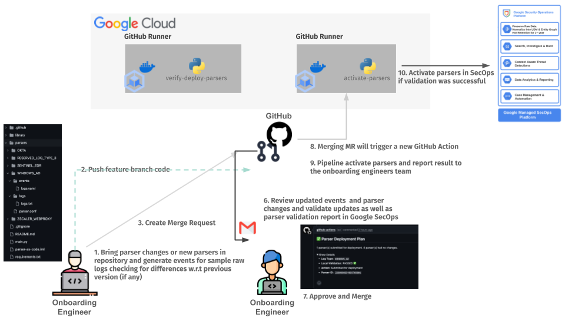

# SecOps Parsers as Code

This repository provides a framework for managing Google SecOps parsers and parser extensions as code. It enables a
robust GitOps workflow with version control, automated local and remote validation, and a CI/CD pipeline that provides
direct feedback on pull requests before deploying changes. To get an understanding of how the automation works, please refer to the [following medium article](https://medium.com/google-cloud/parsers-as-code-in-google-secops-30cf3de785c8) while for setting up the integration with GitHub via Workload Identity Federation reder to this [medium article](https://medium.com/google-cloud/secure-google-secops-automations-the-definitive-guide-to-workload-identity-federation-5b1331db9c0c).


### GitHub CICD Pipeline design



"Icon made by Freepik from www.flaticon.com"

A brief workflow description:

1. **Develop and Commit**: A SOC engineer develops or modifies a parser and/or parser extension within the Google SecOps
   tenant. After testing, the engineer brings the new or updated code into a local Git repository. They upload sample
   logs, generate the corresponding events using the local script, and then commit all changes to a new feature branch.
2. **Create Pull Request**: The engineer creates a Pull Request (PR) in GitHub to merge the feature branch into the
   `main` branch.
3. **Verification and Deployment Pipeline**: Opening the PR automatically triggers a GitHub Actions pipeline. This
   pipeline validates the code, submits the changes to a development or staging environment within Google SecOps, and
   waits for the remote validation to complete. The pipeline then reports the results directly within the PR.
4. **Review and Approval**: Another engineer reviews the proposed changes and the validation report from the pipeline.
   If the changes are acceptable and the pipeline is successful, they approve and merge the PR.
5. **Activation Pipeline**: Merging the PR triggers a final pipeline. This pipeline's job is to activate the newly
   validated parser version in the production Google SecOps environment.
6. **Report Results**: The pipeline concludes by reporting the final activation status to the SOC engineering team,
   often via an automated notification.

---

## 🚀 Features

This framework is built around a two-stage deployment process managed by a CI/CD pipeline:

* **Verify and Deploy (`verify-deploy-parsers`):**
    1.  **Discovery & Planning:** Scans the `parsers/` directory and discovers both CUSTOM and PREBUILT parser configurations
    2.  **Change Detection:** Compares local configurations with active parsers in Chronicle to determine what needs to be created or updated
    3.  **Local Validation:** Runs parsers against sample logs and compares generated events with expected events in `events/` directory
    4.  **Submit to SecOps:** Submits new or updated parsers and/or parser extensions to Chronicle
    5.  **Verification:** Checks submission status via Chronicle API
    6.  **PR Commenting:** Posts a detailed comment on the pull request with the outcome for each artifact, using status emojis (✅, ❌, ⏳) for immediate feedback

* **Activate Parsers (`activate-parsers`):**
    * Finds parsers in `PASSED` state and extensions in `VALIDATED` state
    * Verifies content matches local configurations
    * Activates them in Chronicle (parsers → `ACTIVE`, extensions → `LIVE`)
    * Activates CUSTOM parsers and promotes PREBUILT parsers from Release Candidate to Active

* **Generate Events (`generate-events`):**
    * Runs local parsers against sample log files in the `logs/` directory
    * Generates expected UDM event YAML files in the `events/` directory
    * Supports both CUSTOM and PREBUILT parsers (fetches PREBUILT content from Chronicle)
    * Normalizes output by clearing dynamic fields like `collectedTimestamp`

**Key Capabilities:**

* **CUSTOM Parser Support:** Full lifecycle management (create, update, validate, activate)
* **PREBUILT Parser Support:** Extension-only management with automatic parser content fetching
* **Event Validation:** Ensures parser changes produce expected output before submission
* **GitOps Workflow:** Version control for all parser configurations with automated CI/CD
* **Fail-Fast:** Blocks deployment if local validation fails, preventing bad parsers from reaching production

---

## 📁 Folder Structure

For the scripts and pipeline to work correctly, your repository must adhere to the following structure, which now uses
dedicated `logs` and `events` subdirectories.

```
├── .github/
│   └── workflows/
│       └── secops-pipeline.yml   # Your GitHub Actions workflow file
├── parsers/
│   ├── <LOG_TYPE_A>/             # e.g., CISCO_ASA
│   │   ├── parser.yaml           # Metadata and configuration (Required)
│   │   ├── parser.conf           # The CBN parser configuration (optional for Prebuilt)
│   │   ├── parser_extension.conf # The CBN parser extension (optional)
│   │   ├── logs/                 # Subdirectory for sample logs
│   │   │   └── logs.txt
│   │   └── events/               # Subdirectory for expected events
│   │       └── events.yaml
│   ├── <LOG_TYPE_B>/
│   │   └── ...
│   └── ...
├── script/
│   ├── compare.py                # Parser comparator
│   ├── main.py                   # CLI entry point (using Click)
│   ├── parser_manager.py         # Core business logic
│   ├── models.py                 # Data classes, Enums, and custom exceptions
│   ├── config.py                 # Configuration and constants
│   └── utils.py                  # Utility functions
├── requirements.txt              # Python dependencies
└── README.md                     # This file
```

**Key components:**

* **`parsers/<LOG_TYPE>/`**: Each subdirectory represents a unique log type.
    * **`parser.yaml`**: The source of truth for the parser configuration. Defines the type (CUSTOM/PREBUILT) and file paths.
    * **`parser.conf`**: Contains the full SecOps parser configuration code (Required for CUSTOM).
    * **`parser_extension.conf`**: Contains the parser extension code.
    * **`logs/`**: A directory containing raw sample log files.
    * **`events/`**: A directory containing the expected normalized events in YAML format.
* **`script/`**: Contains all the Python source code for the command-line tool.

**Parser Types:**

* **CUSTOM**: User-defined parsers where both the parser configuration and extension are managed in the repository.
* **PREBUILT**: Google-provided parsers. Extensions can be managed locally. Local script can also detect and release pending "Release Candidates" for Prebuilt parsers if the local code matches the pending version.

---

## 🔧 Working with CUSTOM vs PREBUILT Parsers

### CUSTOM Parsers

**Structure:**
```
parsers/MY_CUSTOM_PARSER/
├── parser.yaml              # Required: Parser configuration
├── parser.conf              # Required: Full parser code
├── parser_extension.conf    # Optional: Extension code
├── logs/                    # Required: Sample log files
│   └── logs.txt
└── events/                  # Optional: Expected event files
    └── events.yaml
```

**Operations Supported:**
- ✅ Create new parser
- ✅ Update existing parser
- ✅ Attach/update parser extension
- ✅ Activate parser after validation
- ✅ Local event generation and validation

**Workflow:**
1. Write parser code in `parser.conf`
2. Add sample logs to `logs/`
3. Generate events: `python3 script/main.py generate-events --log-type MY_CUSTOM_PARSER`
4. Commit changes and create PR
5. Pipeline validates, submits, and (after merge) activates

### PREBUILT Parsers

**Structure:**
```
parsers/MY_PREBUILT_PARSER/
├── parser.yaml              # Required: Parser configuration
├── parser.conf              # Required: Parser prebuilt code or pending release code
├── parser_extension.conf    # Optional: Parser extension code
├── logs/                    # Required: Sample log files
│   └── logs.txt
└── events/                  # Required: Expected event files
    └── events.yaml
```

**Operations Supported:**
- ✅ Release pending Release Candidates (if local code matches pending RC)
- ✅ Attach/update parser extension
- ✅ Activate extension after validation
- ✅ Local event generation and validation
- ❌ Create/update base parser (managed by Google)

**Workflow:**
1. Write extension code in `parser_extension.conf`
2. Add sample logs to `logs/`
3. Generate events: `python3 script/main.py generate-events --log-type MY_PREBUILT_PARSER`
   - The script automatically fetches the PREBUILT parser from Chronicle for validation
4. Commit changes and create PR
5. Pipeline validates extension output, submits extension, and (after merge) activates

**Key Differences:**

| Feature | CUSTOM | PREBUILT |
|---------|--------|----------|
| Base parser managed locally | ✅ Yes | ❌ No (read-only) |
| Extension managed locally | ✅ Yes | ✅ Yes |
| Requires `parser.conf` | ✅ Yes | ❌ No |
| Requires `parser_extension.conf` | Optional | ✅ Yes |
| Parser activation | ✅ Yes | ✅ Yes (if Release Candidate matches) |
| Extension activation | ✅ Yes | ✅ Yes |
| Auto-fetches parser content | ❌ Not needed | ✅ Yes (for validation) |

---

## 🛠️ Local Setup

1.  **Clone the repository:**
    ```bash
    git clone <your-repo-url>
    cd <your-repo-name>
    ```

2.  **Create and activate a Python virtual environment (recommended):**
    ```bash
    python3 -m venv .venv
    source .venv/bin/activate
    ```

3.  **Install dependencies:**
    ```bash
    pip install -r requirements.txt
    ```

    **Key Dependencies:**
    - `click`: Command-line interface framework
    - `secops`: Google SecOps Python client library
    - `pyyaml`: YAML parsing and generation
    - `python-dotenv`: Environment variable management from `.env` files
    - Google authentication libraries (`google-auth`, `google-auth-oauthlib`, etc.)

4.  **Set Environment Variables (for local execution):**
    To run the scripts locally, you can either set environment variables in your shell or create a `.env` file in the root directory:

    **Option 1: Export variables in your shell:**
    ```bash
    export SECOPS_CUSTOMER_ID="your-secops-customer-id"
    export SECOPS_PROJECT_ID="your-gcp-project-id"
    export SECOPS_REGION="your-secops-region" # e.g., eu, us
    ```

    **Option 2: Create a `.env` file:**
    ```bash
    SECOPS_CUSTOMER_ID=your-secops-customer-id
    SECOPS_PROJECT_ID=your-gcp-project-id
    SECOPS_REGION=your-secops-region
    ```

    **Authentication:**
    For local development, authenticate via the gcloud CLI:
    ```bash
    gcloud auth application-default login
    ```
    Ensure your user has the necessary IAM permissions on the `SECOPS_PROJECT_ID` to interact with SecOps APIs.

---

## 💻 Script Usage (CLI)

The `main.py` script uses [Click](https://click.palletsprojects.com/) for its command-line interface.

**Primary Commands:**

* **Verify, Deploy, and Poll for Status:**
  This command runs the entire pre-merge workflow: local validation, submission to SecOps, and polling for the remote validation status.
    ```bash
    python3 script/main.py verify-deploy-parsers
    ```

  **What it does:**
  - **Phase 1**: Plans deployment by comparing local configurations with active parsers in Chronicle
  - **Phase 2**: Validates local parser output against expected events in `events/` directory
  - **Phase 3**: Submits new or updated parsers/extensions to Chronicle
  - **Phase 4**: Waits 60 seconds and then verifies submission status
  - Generates a PR comment with detailed results (when running in GitHub Actions)

* **Activate Merged Parsers:**
  This command activates parsers and extensions that have been successfully validated. It is intended to be run by the CI/CD pipeline after a PR is merged.
    ```bash
    python3 script/main.py activate-parsers
    ```

  **What it does:**
  - Finds parsers in `PASSED` validation state and extensions in `VALIDATED` state
  - Matches them against local configurations to ensure consistency
  - Activates them in Chronicle (makes them `ACTIVE` or `LIVE`)
  - Only activates CUSTOM parsers (PREBUILT parsers are read-only)

* **Generate Local Event Files:**
  This command updates the `events/*.yaml` files by running the local parser configurations against the `logs/*.log` files. This is useful when developing or updating a parser.
    ```bash
    python3 script/main.py generate-events
    ```
  To generate events for only one specific parser:
    ```bash
    python3 script/main.py generate-events --log-type <LOG_TYPE_NAME>
    ```

  **What it does:**
  - Reads all log files from the `logs/` subdirectory
  - Runs the parser (and extension if present) against the logs using the Chronicle API
  - Saves the generated UDM events to YAML files in the `events/` subdirectory
  - For PREBUILT parsers, fetches the parser content from Chronicle if not available locally

* **Pull Parser:**
  Fetches the active parser configuration (and extension) from Chronicle and updates/creates the local files.
    ```bash
    python3 script/main.py pull-parser --log-type <LOG_TYPE>
    ```

* **Pull All Parsers:**
  Bulk fetches ALL active parsers from the tenant and updates/creates local files.
    ```bash
    python3 script/main.py pull-parsers
    ```
  **Note:** This is useful for initial repository population or synchronization.

---

## 🔍 Validation & Error Handling

The framework includes comprehensive validation to ensure parser quality:

### Event Validation Process

1. **Sample Logs Required:** Each parser must have sample log files in the `logs/` subdirectory
2. **Expected Events Required:** Corresponding expected event files must exist in the `events/` subdirectory
3. **Validation Runs:** When `verify-deploy-parsers` is executed:
   - All sample logs are read and processed through the parser
   - Generated events are compared with expected events
   - Differences are detected using YAML-aware comparison
   - Certain fields are ignored (e.g., `timestamp`, `Timestamp`, `etag`, `collectedTimestamp`)

### Parser States

**For Parsers (CUSTOM only):**
- `ACTIVE`: Currently in production use
- `INACTIVE`: Created but not yet activated
- `PASSED`: Successfully validated by Chronicle, ready for activation
- `FAILED`: Failed Chronicle validation

**For Parser Extensions (both CUSTOM and PREBUILT):**
- `LIVE`: Currently in production use
- `VALIDATED`: Successfully validated by Chronicle, ready for activation
- `REJECTED`: Failed Chronicle validation

### Error Handling

The framework uses custom exceptions for clear error reporting:

- **`ParserError`**: Base exception for all application errors
- **`ValidationError`**: Raised when local event validation fails
- **`APIError`**: Raised when Chronicle API communication fails
- **`InitializationError`**: Raised when required environment variables are missing

When validation fails, the pipeline:
1. Logs detailed error messages
2. Marks the operation as failed in the deployment plan
3. Prevents submission to Chronicle
4. Reports failure in the PR comment with ❌ `EVENT_VALIDATION_FAILED`

### PR Comment Format

The pipeline generates structured PR comments with the following format:

**Example for CUSTOM parser:**
```markdown
✅ Parser Deployment Plan

2 log type(s) had changes submitted. Review validation status below.

- **Log Type**: `MY_CUSTOM_PARSER`
  - **Parser Type**: `CUSTOM`
  - **Parser Action**: `CREATE`
  - **Validation Status**: PASSED ✅
  - **Details**: Created CUSTOM parser. Parser ID: `abc123`
  - **Parser Extension Action**: `CREATE`
  - **Validation Status**: VALIDATED ✅
  - **Details**: Attached extension to CUSTOM parser. Extension ID: `def456`

📉 UDM Comparison Report

============================================================
COMPARISON REPORT: MY_CUSTOM_PARSER
============================================================
Events Generated (Old): 1
Events Generated (New): 1
Event counts match.
------------------------------------------------------------
No field-level changes detected (excluding timestamps/etags).
------------------------------------------------------------
No raw YAML validation differences found.
============================================================
```

**Example for PREBUILT parser:**
```markdown
✅ Parser Deployment Plan

1 log type(s) had changes submitted. Review validation status below.

- **Log Type**: `MY_PREBUILT_PARSER`
  - **Parser Type**: `PREBUILT`
  - **Parser**: Using PREBUILT parser from SecOps (read-only)
  - **Parser Extension Action**: `UPDATE`
  - **Validation Status**: VALIDATED ✅
  - **Details**: Updated extension to PREBUILT parser. Extension ID: `xyz789`

📉 UDM Comparison Report

============================================================
COMPARISON REPORT: MY_PREBUILT_PARSER
============================================================
Events Generated (Old): 1
Events Generated (New): 1
Event counts match.
------------------------------------------------------------
No field-level changes detected (excluding timestamps/etags).
------------------------------------------------------------
No raw YAML validation differences found.
============================================================
```

**Example with validation failure:**
```markdown
❌ Parser Deployment Failed

Errors were encountered during the process. See action logs for details.

- **Log Type**: `BROKEN_PARSER`
  - **Parser Type**: `CUSTOM`
  - **Parser Action**: `UPDATE`
  - **Validation Status**: EVENT_VALIDATION_FAILED ❌
  - **Details**: Not submitted due to local event validation failure.
```

---

## ⚙️ GitHub Actions Pipeline

The CI/CD pipeline automates the two-stage deployment process.

### Github Actions Logic

**Stage 1: On Pull Request (Opened, Synchronized)**

1. The `verify-deploy-parsers` job is triggered.
2. It runs the deployment planning and local validation:
   - Discovers local parser configurations
   - Compares with active parsers in Chronicle
   - Validates generated events match expected events in `events/` directory
3. If local validation passes, it submits the changed parsers/extensions to Chronicle.
4. Waits 60 seconds for Chronicle validation to begin.
5. Verifies the submission status from the Chronicle API.
6. Posts a **comment on the pull request** summarizing the results for each parser/extension:
   - ✅ `PASSED` (parsers) or `VALIDATED` (extensions)
   - ❌ `FAILED` (parsers) or `REJECTED` (extensions)
   - ⏳ Still pending
   - ❌ `EVENT_VALIDATION_FAILED` (local validation failed)
7. Merging is only allowed if this job succeeds.

**Stage 2: On Pull Request (Closed & Merged)**

1. The `activate-parsers` job is triggered.
2. It runs the `activate-parsers` command to promote validated artifacts:
   - Parsers in `PASSED` state → `ACTIVE`
   - Extensions in `VALIDATED` state → `LIVE`
3. Only activates items that match the local configuration content (ensures consistency).

### Environment Variables & Secrets

Configure the following in your GitHub repository settings (`Settings > Secrets and variables > Actions`):

**Workflow Environment Variables:**
These are non-sensitive and can be defined in the `env:` block of your workflow file.

```yaml
env:
  SECOPS_CUSTOMER_ID: "your-secops-customer-id"
  SECOPS_PROJECT_ID: "your-gcp-project-id"
  SECOPS_REGION: "your-secops-region"
  # For Workload Identity Federation (WIF)
  SERVICE_ACCOUNT: "your-gcp-service-account@your-project.iam.gserviceaccount.com"
  WIF_PROVIDER: "projects/your-gcp-project-number/locations/global/workloadIdentityPools/your-pool/providers/your-provider"
```

**IAM Permissions for Workload Identity Federation**

The GCP SERVICE_ACCOUNT used by the pipeline requires the following IAM permissions:

1- **Workload Identity User:**
Role: roles/iam.workloadIdentityUser
Principal: principalSet://iam.googleapis.com/projects/<PROJECT_NUMBER>/locations/global/workloadIdentityPools/<POOL_ID>
/attribute.repository/<OWNER/REPO>

2- **SecOps API Permissions:**
Role: roles/chronicle.admin (easiest) or a custom role with the following permissions:

* `chronicle.instances.get`
* `chronicle.parserExtensions.activate`
* `chronicle.parserExtensions.create`
* `chronicle.parserExtensions.delete`
* `chronicle.parserExtensions.generateKeyValueMappings`
* `chronicle.parserExtensions.get`
* `chronicle.parserExtensions.legacySubmitParserExtension`
* `chronicle.parserExtensions.list`
* `chronicle.parserExtensions.removeSyslog`
* `chronicle.parsers.activate`
* `chronicle.parsers.activateReleaseCandidate`
* `chronicle.parsers.copyPrebuiltParser`
* `chronicle.parsers.create`
* `chronicle.parsers.deactivate`
* `chronicle.parsers.delete`
* `chronicle.parsers.generateEventTypesSuggestions`
* `chronicle.parsers.get`
* `chronicle.parsers.list`
* `chronicle.parsers.runParser`
* `chronicle.parsers.update`

## License

Copyright 2026 Google. This software is provided as-is, without warranty or representation for any use or purpose. Your
use of it is subject to your agreement with Google.
