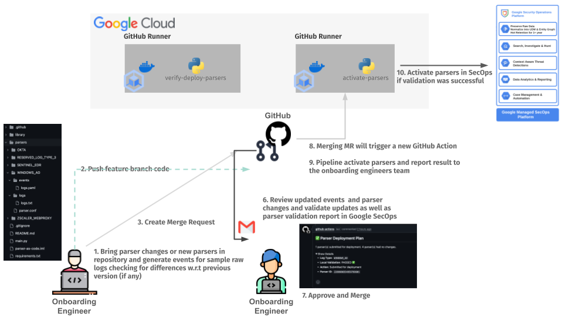

# SecOps Parsers as Code

This repository provides a framework for managing Google SecOps parsers and parser extensions as code. It enables a
robust GitOps workflow with version control, automated local and remote validation, and a CI/CD pipeline that provides
direct feedback on pull requests before deploying changes.

### GitHub CICD Pipeline design



"Icon made by Freepik from www.flaticon.com"

A brief workflow description:

1. **Develop and Commit**: A SOC engineer develops or modifies a parser and/or parser extension within the Google SecOps
   tenant. After testing, the engineer brings the new or updated code into a local Git repository. They upload sample
   logs, generate the corresponding events using the local script, and then commit all changes to a new feature branch.
2. **Create Pull Request**: The engineer creates a Pull Request (PR) in GitHub to merge the feature branch into the
   `main` branch.
3. **Verification and Deployment Pipeline**: Opening the PR automatically triggers a GitHub Actions pipeline. This
   pipeline validates the code, submits the changes to a development or staging environment within Google SecOps, and
   waits for the remote validation to complete. The pipeline then reports the results directly within the PR.
4. **Review and Approval**: Another engineer reviews the proposed changes and the validation report from the pipeline.
   If the changes are acceptable and the pipeline is successful, they approve and merge the PR.
5. **Activation Pipeline**: Merging the PR triggers a final pipeline. This pipeline's job is to activate the newly
   validated parser version in the production Google SecOps environment.
6. **Report Results**: The pipeline concludes by reporting the final activation status to the SOC engineering team,
   often via an automated notification.

---

## 🚀 Features

This framework is built around a two-stage deployment process managed by a CI/CD pipeline:

* **Verify and Deploy (`verify-and-deploy`):**
    1.  **Local Validation:** Automatically runs the parser (and extension, if present) against sample logs and compares the output with expected events to ensure correctness.
    2.  **Submit to SecOps:** Submits new or updated parsers and/or parser extensions to your SecOps instance.
    3.  **Poll for Status:** Actively polls the SecOps API to get the final validation status (`PASSED`, `FAILED`, `VALIDATED`, `REJECTED`) from the SecOps backend.
    4.  **PR Commenting:** Posts a detailed comment on the pull request with the outcome for each artifact, using status emojis (✅, ❌, ⏳) for a clear and immediate feedback loop.

* **Activate Parsers (`activate-parsers`):**
    * After a pull request is merged, this command runs to activate the parsers and extensions that have been successfully validated by SecOps, completing the deployment process.

* **Generate Events (`generate-events`):**
    * A utility to locally generate the expected event output files in the `events/` directory by running the local parser and extension against the sample log files in the `logs/` directory.

---

## 📁 Folder Structure

For the scripts and pipeline to work correctly, your repository must adhere to the following structure, which now uses
dedicated `logs` and `events` subdirectories.

```
├── .github/
│   └── workflows/
│       └── secops-pipeline.yml   # Your GitHub Actions workflow file
├── parsers/
│   ├── <LOG_TYPE_A>/             # e.g., CISCO_ASA
│   │   ├── parser.conf           # The CBN parser configuration (optional)
│   │   ├── parser_extension.conf # The CBN parser extension (optional)
│   │   ├── logs/                 # Subdirectory for sample logs
│   │   │   └── sample1.log
│   │   └── events/               # Subdirectory for expected events
│   │       └── sample1.yaml
│   ├── <LOG_TYPE_B>/
│   │   └── ...
│   └── ...
├── script/
│   ├── main.py                   # CLI entry point (using Click)
│   ├── parser_manager.py         # Core business logic
│   ├── chronicle_api.py          # Handles communication with the SecOps API
│   ├── models.py                 # Data classes, Enums, and custom exceptions
│   ├── config.py                 # Configuration and constants
│   └── utils.py                  # Utility functions
├── requirements.txt              # Python dependencies
└── README.md                     # This file
```

**Key components:**

* **`parsers/<LOG_TYPE>/`**: Each subdirectory represents a unique log type. It must contain at least one configuration file.
    * **`parser.conf`**: Contains the full SecOps parser configuration code.
    * **`parser_extension.conf`**: Contains the parser extension code.
    * **`logs/`**: A directory containing raw sample log files.
    * **`events/`**: A directory containing the expected normalized events in YAML format, corresponding to the log files.
* **`script/`**: Contains all the Python source code for the command-line tool.

---

## 🛠️ Local Setup

1.  **Clone the repository:**
    ```bash
    git clone <your-repo-url>
    cd <your-repo-name>
    ```

2.  **Create and activate a Python virtual environment (recommended):**
    ```bash
    python3 -m venv .venv
    source .venv/bin/activate
    ```

3.  **Install dependencies:**
    ```bash
    pip install -r requirements.txt
    ```

4.  **Set Environment Variables (for local execution):**
    To run the scripts locally, export these variables in your shell:
    ```bash
    export SECOPS_CUSTOMER_ID="your-secops-customer-id"
    export SECOPS_PROJECT_ID="your-gcp-project-id"
    export SECOPS_REGION="your-secops-region" # e.g., eu, us

    # For local development, authenticate via the gcloud CLI
    gcloud auth application-default login
    ```
    Ensure your user has the necessary IAM permissions on the `SECOPS_PROJECT_ID` to interact with SecOps APIs.

---

## 💻 Script Usage (CLI)

The `main.py` script uses [Click](https://click.palletsprojects.com/) for its command-line interface. Note that you must now specify the `script/` path when running the commands.

**Primary Commands:**

* **Verify, Deploy, and Poll for Status:**
  This command runs the entire pre-merge workflow: local validation, submission to SecOps, and polling for the remote validation status.
    ```bash
    python3 script/main.py verify-and-deploy
    ```

* **Activate Merged Parsers:**
  This command activates parsers and extensions that have been successfully validated. It is intended to be run by the CI/CD pipeline after a PR is merged.
    ```bash
    python3 script/main.py activate-parsers
    ```

* **Generate Local Event Files:**
  This command updates the `events/*.yaml` files by running the local parser configurations against the `logs/*.log` files. This is useful when developing or updating a parser.
    ```bash
    python3 script/main.py generate-events
    ```
  To generate events for only one specific parser:
    ```bash
    python3 script/main.py generate-events --parser <LOG_TYPE_NAME>
    ```

---

## ⚙️ GitHub Actions Pipeline

The CI/CD pipeline automates the two-stage deployment process.

### Github Actions Logic

**Stage 1: On Pull Request (Opened, Synchronized)**

1. The `verify-deploy-parsers` job is triggered.
2. It runs local validation against sample logs.
3. If local validation passes, it submits the changed parsers to SecOps.
4. It **polls** the SecOps API for up to 5 minutes, waiting for a final validation status (`PASSED` or `FAILED`).
5. It posts a **comment on the pull request** summarizing the results for each parser, indicating success (✅), failure (
   ❌), or timeout (⏳).
6. Merging is only allowed if this job succeeds.

**Stage 2: On Pull Request (Closed & Merged)**

1. The `activate-parsers` job is triggered.
2. It checks the status of the parsers from the merged branch one last time.
3. It runs the `activate-parsers` command to promote any parsers that are in a `PASSED` state to `ACTIVE` in SecOps.

### Environment Variables & Secrets

Configure the following in your GitHub repository settings (`Settings > Secrets and variables > Actions`):

**Workflow Environment Variables:**
These are non-sensitive and can be defined in the `env:` block of your workflow file.

```yaml
env:
  SECOPS_CUSTOMER_ID: "your-secops-customer-id"
  SECOPS_PROJECT_ID: "your-gcp-project-id"
  SECOPS_REGION: "your-secops-region"
  # For Workload Identity Federation (WIF)
  SERVICE_ACCOUNT: "your-gcp-service-account@your-project.iam.gserviceaccount.com"
  WIF_PROVIDER: "projects/your-gcp-project-number/locations/global/workloadIdentityPools/your-pool/providers/your-provider"
```

**IAM Permissions for Workload Identity Federation**

The GCP SERVICE_ACCOUNT used by the pipeline requires the following IAM permissions:

1- **Workload Identity User:**
Role: roles/iam.workloadIdentityUser
Principal: principalSet://iam.googleapis.com/projects/<PROJECT_NUMBER>/locations/global/workloadIdentityPools/<POOL_ID>
/attribute.repository/<OWNER/REPO>

2- **SecOps API Permissions:**
Role: roles/chronicle.admin (easiest) or a custom role with the following permissions:

* `chronicle.parsers.create`
* `chronicle.parsers.get`
* `chronicle.parsers.list`
* `chronicle.parsers.run`
* `chronicle.parsers.activate`
* `chronicle.parserExtensions.create`
* `chronicle.parserExtensions.get`
* `chronicle.parserExtensions.list`
* `chronicle.parserExtensions.activate`

## License

Copyright 2025 Google. This software is provided as-is, without warranty or representation for any use or purpose. Your
use of it is subject to your agreement with Google.  