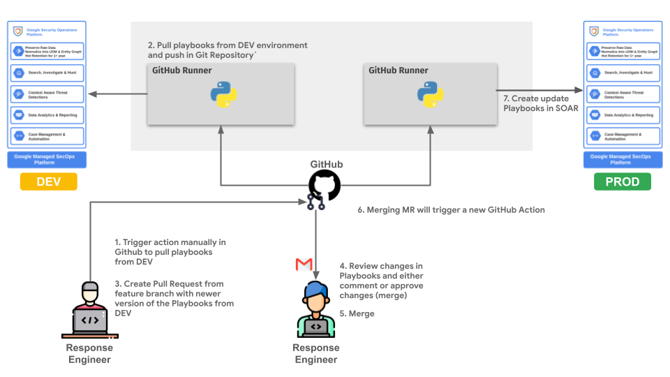

# Response as Code for SOAR Playbooks 🚀

This repository contains the tools and pipeline configuration to manage and deploy SOAR playbooks using a **Response as Code** methodology. All playbook logic is stored and version-controlled in Git, and deployments to the SOAR platform are handled automatically by either a GitHub or GitLab CI/CD pipeline.

This is a customized version of the code available for GitSync integration on SecOps SOAR and available [here](https://github.com/chronicle/marketplace/tree/main/integrations/third_party/git_sync).

## GitLab / GitHub CICD Pipeline design



"Icon made by Freepik from www.flaticon.com"

The deployment process is fully automated through GitLab/GitHub CI/CD, triggered by changes to this repository.

1.  **Development**: A response engineer pulls existing playbooks from a non-production SOAR instance either using the `pull-playbooks` command or develops new ones locally. Changes are committed to a feature branch.
2.  **Merge Request**: A Merge Request (MR) is created in GitLab to merge the changes into the default branch (`main`). This allows for team review and approval.
3.  **Automated Deployment**: Once the MR is merged, the `.gitlab-ci.yml` pipeline automatically triggers the `sync-playbooks` stage.
4.  **Execution**: The pipeline runs the `main.py sync-playbooks` command, which reads the playbook files from the repository and deploys them to the production SOAR instance defined in the CI/CD variables.

***

## Repository Structure

* **`.github`**: GitHub workflow definition for the CI/CD pipeline.
* **`main.py`**: The core Python script for pulling from and syncing to the SOAR platform.
* **`soar`**: SOAR customized library based on GitSync integration.
* **`.gitlab-ci.yml`**: Defines the GitLab CI/CD pipeline that automates playbook deployment.
* **`requirements.txt`**: A list of required Python dependencies for the script.
* **`/playbooks`**: The directory containing all the exported SOAR playbooks as code (default location, can be configured).

***

## 🛠️ Local Setup

While the primary workflow is automated, you can run the script locally to develop, test, or pull playbooks from a source environment.

1. **Clone the repository:**
   ```bash
   git clone <your-repo-url>
   cd <your-repo-name>
   ```

2. **Create and activate a Python virtual environment (recommended):**
   ```bash
   python3 -m venv .venv
   source .venv/bin/activate
   ```

3. **Install dependencies:**
   ```bash
   pip install -r requirements.txt
   ```

4. **Set the required environment variables**

### Pulling Playbooks from source SOAR

To export playbooks from a SOAR instance and save them to your local repository:

```bash
# Set environment variables for the SOURCE environment
export SOURCE_SOAR_API_URL="https://*.siemplify-soar.com/api/"
export SOURCE_SOAR_API_KEY="your_dev_api_key"
export INCLUDE_PLAYBOOK_BLOCKS="true"

# Run the pull command
python3 main.py pull-playbooks
```

### Syncing Playbooks to target SOAR
To manually push playbooks from your local repository to a SOAR instance (e.g., a staging environment):

```bash
# Set environment variables for the TARGET environment
export TARGET_SOAR_API_URL="https://*..siemplify-soar.com/api/"
export TARGET_SOAR_API_KEY="your_staging_api_key"

# Run the sync command
python3 main.py sync-playbooks
```

## GitHub Configuration

### Pull Playbooks Workflow

This document explains how to configure and use the `Response As Code: Pull Playbooks` GitHub Action.

This action **manually pulls** playbooks from a source SOAR platform and updates the repository files to match. This is useful for synchronizing your codebase with the live state of playbooks on the platform. Any changes are automatically committed back to the branch you run the action on.

---

#### Configuration ⚙️

Before running the workflow, you must configure the following repository secrets and variables.

1.  In your GitHub repository, navigate to **Settings**.
2.  In the left sidebar, expand **Secrets and variables**, then click on **Actions**.

You will need to add the following:

| Name | Type | Description                                                                         |
| :--- | :--- |:------------------------------------------------------------------------------------|
| `SOURCE_SOAR_API_KEY` | **Secret** | The API key for authenticating with the source SOAR platform.                       |
| `SOURCE_SOAR_API_URL` | **Variable** | The base URL for the source SOAR platform's API (e.g., `https://*..siemplify-soar.com/api/`).    |
| `LOCAL_SYNC_PATH` | **Variable** | The local directory path within the repository where the playbooks should be saved. |

---

#### How to Run the Workflow ▶️

This workflow is designed to be triggered manually on any branch.

1.  In your GitHub repository, click on the **Actions** tab.
2.  In the list of workflows on the left, click on **Response As Code: Pull Playbooks**.
3.  Above the list of previous runs, click the **Run workflow** dropdown button.
4.  Use the dropdown menu to select the **branch** you want to update.
5.  Click the green **Run workflow** button to start the process.

The action will now run, pull the latest playbooks from your SOAR platform, and automatically commit any changes directly to the branch you selected.

### Sync Playbooks Workflow

This document explains how to configure and use the `Response As Code: Sync Playbooks` GitHub Action.

This action automatically deploys playbooks from this repository to a target Security Orchestration, Automation, and Response (SOAR) platform.

The workflow is triggered automatically **when a pull request is merged into the `main` branch**. This ensures that only reviewed and approved changes are synced to the target system.

---

#### Configuration ⚙️

Before the workflow can run, you must configure the following repository secrets and variables.

1.  In your GitHub repository, navigate to **Settings**.
2.  In the left sidebar, expand **Secrets and variables**, then click on **Actions**.

You will need to add the following:

| Name                    | Type       | Description                                                                                  |
| :---------------------- | :--------- |:---------------------------------------------------------------------------------------------|
| `TARGET_SOAR_API_KEY`   | **Secret** | The API key for authenticating with the target SOAR platform.                                |
| `TARGET_SOAR_API_URL`   | **Variable** | The base URL for the target SOAR platform's API (e.g., `https://*.siemplify-soar.com/api/`). |
| `LOCAL_SYNC_PATH`       | **Variable** | The local directory path within the repository that contains the playbooks to be synced.     |

---

#### Usage Workflow ▶️

To deploy changes to your playbooks, follow these steps:

1.  Create a new branch from `main` to make your changes.
2.  Modify, add, or delete playbooks within the directory defined by your `LOCAL_SYNC_PATH` variable by leveraging the `Pull Playbooks Workflow`
3.  Open a pull request targeting the `main` branch.
4.  Once your pull request has been reviewed and approved, **merge it**.
5.  Merging the pull request will automatically trigger the **"Response As Code: Sync Playbooks"** action. You can monitor its progress in the **Actions** tab of the repository.


### GitLab CI/CD Configuration 🛠️

The pipeline is configured in .gitlab-ci.yml and relies on GitLab CI/CD variables for connecting to the target SOAR environment. These variables must be configured in your GitLab project.

Go to Settings > CI/CD > Variables and add the following:

| Variable             | 	Description                                   | 	Example Value         |	Protected |	Masked |
|----------------------|------------------------------------------------|------------------------|------------|---------|
| SOURCE_SOAR_API_URL  | The API URL of the development SOAR instance.  | https://*.siemplify-soar.com/api/	 | Yes |	No |
| SOURCE_SOAR_API_KEY	 | The API key for the development SOAR instance. | 	glpat-xxxxxxxxxx      | Yes	| Yes |
| TARGET_SOAR_API_URL  | The API URL of the production SOAR instance.   | https://*.siemplify-soar.com/api/	 | Yes |	No |
| TARGET_SOAR_API_KEY	 | The API key for the production SOAR instance.  | 	glpat-xxxxxxxxxx      | Yes	| Yes |

Export to Sheets
Note: It is critical to set the TARGET_SOAR_API_KEY as Masked to prevent it from being exposed in job logs. Both variables should be Protected to ensure they are only available on protected branches, like main.
