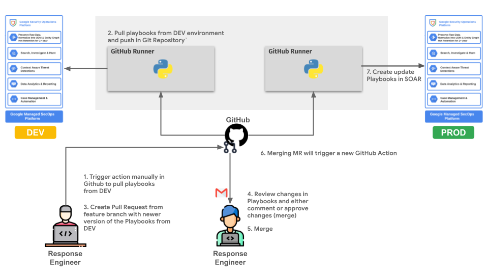

# Response as Code for SOAR Playbooks 🚀

This repository contains the tools and pipeline configuration to manage and deploy SOAR playbooks using a **Response as Code** methodology. All playbook logic is stored and version-controlled in Git, and deployments to the SOAR platform are handled automatically by a GitHub CI/CD pipeline.

This script is based on new [Chronicle APIs](https://docs.cloud.google.com/chronicle/docs/reference/rest) for Google SecOps SOAR, legacy APIs are not supported anymore. If you are looking for the previous version of response as code based on GitSync integration you can find it [here](https://github.com/GoogleCloudPlatform/secops-toolkit/tree/v1.0.0).

## GitHub CICD Pipeline design



"Icon made by Freepik from www.flaticon.com"

The deployment process is fully automated through GitHub CI/CD, triggered by changes to this repository.

1.  **Development**: A response engineer pulls existing playbooks from a non-production SOAR instance either using the `pull-playbooks` command or develops new ones locally. Changes are committed to a feature branch which should be created and used for running the "Response As Code: Pull Playbooks" workflow.
2.  **Merge Request**: A Pull Request (PR) is created to merge the changes into the default branch (`main`). This allows for team review and approval.
3.  **Automated Deployment**: Once the PR is merged, the "Response As Code: Sync Playbooks" workflow automatically triggers.
4.  **Execution**: The workflow reads playbook files from the repository and deploys them to the target SOAR instance defined in the CI/CD variables.

## Repository Structure

* **`.github`**: GitHub workflow definition for the CI/CD pipeline.
* **`script/`**: Directory containing the core Python script for pulling from and syncing to the SOAR platform.
* **`script/requirements.txt`**: A list of required Python dependencies for the script.
* **`playbooks/`**: Directory containing all the exported SOAR playbooks as code (default location, can be configured).

## 🛠️ Local Setup

While the primary workflow is automated, you can run the script locally to develop, test, or pull playbooks from a source environment.

1. **Clone the repository:**
   ```bash
   git clone <your-repo-url>
   cd <your-repo-name>
   ```

2. **Create and activate a Python virtual environment (recommended):**
   ```bash
   python3 -m venv .venv
   source .venv/bin/activate
   ```

3. **Install dependencies:**
   ```bash
   pip install -r ./script/requirements.txt
   ```

4. **Set the required environment variables**

### Pulling Playbooks from source SOAR

To export playbooks from a SOAR instance and save them to your local repository first create a .env file with the following variables:

```bash
SECOPS_CUSTOMER_ID="xxxxxxxx-xxxx-4xxx-xxxxx-xxxxxxxxxxxx"
SECOPS_PROJECT_ID="xxxxx"
SECOPS_REGION="eu"
LOCAL_SYNC_PATH="Playbooks"
```

then issue the following command:

```bash
python3 main.py pull-playbooks
```

### Syncing Playbooks to target SOAR
To manually push playbooks from your local repository to a SOAR instance (e.g., a staging environment) first create a .env file (or use the previous one if valid) with the following variables:

```bash
SECOPS_CUSTOMER_ID="xxxxxxxx-xxxx-4xxx-xxxxx-xxxxxxxxxxxx"
SECOPS_PROJECT_ID="xxxxx"
SECOPS_REGION="eu"
LOCAL_SYNC_PATH="Playbooks"
```

Note that `SECOPS_CUSTOMER_ID`, `SECOPS_PROJECT_ID` and `SECOPS_REGION` might be the same used for pull-playbooks so please make sure to update those values in case deployment should happen on a different SOAR instance.

Then issue the following command:

```bash
python3 main.py sync-playbooks
```

## GitHub Configuration

### Pull Playbooks Workflow

This document explains how to configure and use the `Response As Code: Pull Playbooks` GitHub Action.

This action **manually pulls** playbooks from a source SOAR platform and updates the repository files to match. This is useful for synchronizing your codebase with the live state of playbooks on the platform. Any changes are automatically committed back to the branch you run the action on.

---

#### Configuration ⚙️

Before running the workflow, you must configure the following repository secrets and variables.

1.  In your GitHub repository, navigate to **Settings**.
2.  In the left sidebar, expand **Secrets and variables**, then click on **Actions**.

You will need to add the following:

| Name | Type | Description                                                                         |
| :--- | :--- |:------------------------------------------------------------------------------------|
| `SOURCE_SECOPS_CUSTOMER_ID` | **Variable** | The customer ID for the source SecOps SOAR platform. |
| `SOURCE_SECOPS_PROJECT_ID` | **Variable** | The project ID for the source SecOps SOAR platform. |
| `SOURCE_SECOPS_REGION` | **Variable** | The region for the source SecOps SOAR platform. |
| `TARGET_SECOPS_CUSTOMER_ID` | **Variable** | The customer ID for the target SecOps SOAR platform. |
| `TARGET_SECOPS_PROJECT_ID` | **Variable** | The project ID for the target SecOps SOAR platform. |
| `TARGET_SECOPS_REGION` | **Variable** | The region for the target SecOps SOAR platform. |
| `SERVICE_ACCOUNT` | **Variable** | The service account used for the SecOps SOAR platform authentication via WIF.    |
| `WIF_PROVIDER` | **Variable** | The WIF provider for the SecOps SOAR platform authentication via WIF.    |
| `LOCAL_SYNC_PATH` | **Variable** | The local directory path within the repository where the playbooks should be saved. |

#### How to Run the Workflow ▶️

This workflow is designed to be triggered manually on any branch.

1.  In your GitHub repository, click on the **Actions** tab.
2.  In the list of workflows on the left, click on **Response As Code: Pull Playbooks**.
3.  Above the list of previous runs, click the **Run workflow** dropdown button.
4.  Use the dropdown menu to select the **branch** you want to update.
5.  Click the green **Run workflow** button to start the process.

The action will now run, pull the latest playbooks from your SOAR platform, and automatically commit any changes directly to the branch you selected.

### Sync Playbooks Workflow

This document explains how to configure and use the `Response As Code: Sync Playbooks` GitHub Action.

This action automatically deploys playbooks from this repository to a target SecOps SOAR platform.

The workflow is triggered automatically **when a pull request is merged into the `main` branch**. This ensures that only reviewed and approved changes are synced to the target system.

---

#### Configuration ⚙️

Before the workflow can run, you must configure the following repository secrets and variables.

Please make sure GitHub Actions variables are aligned with the configuration reported in the Pull Playbooks Workflow section documented earlier in this document. If that is the case the environment variables already configured in the repository should be sufficient.

#### Usage Workflow ▶️

To deploy changes to your playbooks, follow these steps:

1.  Create a new branch from `main` to make your changes.
2.  Modify, add, or delete playbooks within the directory defined by your `LOCAL_SYNC_PATH` variable by leveraging the `Pull Playbooks Workflow`
3.  Open a pull request targeting the `main` branch.
4.  Once your pull request has been reviewed and approved, **merge it**.
5.  Merging the pull request will automatically trigger the **"Response As Code: Sync Playbooks"** action. You can monitor its progress in the **Actions** tab of the repository.
